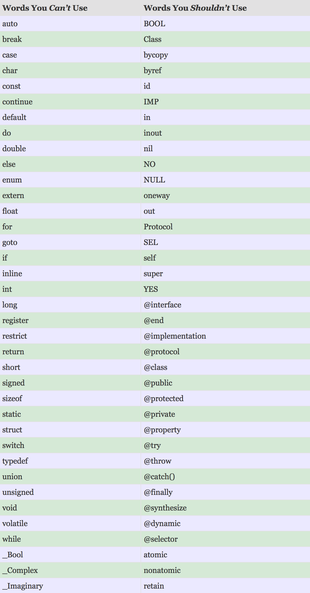

## Learn Objective-C: Reserved Keywords

Objective-C reserves certain words, so that you can’t, or shouldn’t, use them in your own code. At best, you’ll get a compiler warning or error; at worst, you’ll get a nasty bug that you won’t discover until millions of people are already using your app. Here is a list of reserved keywords, to help you avoid that pitfall.

