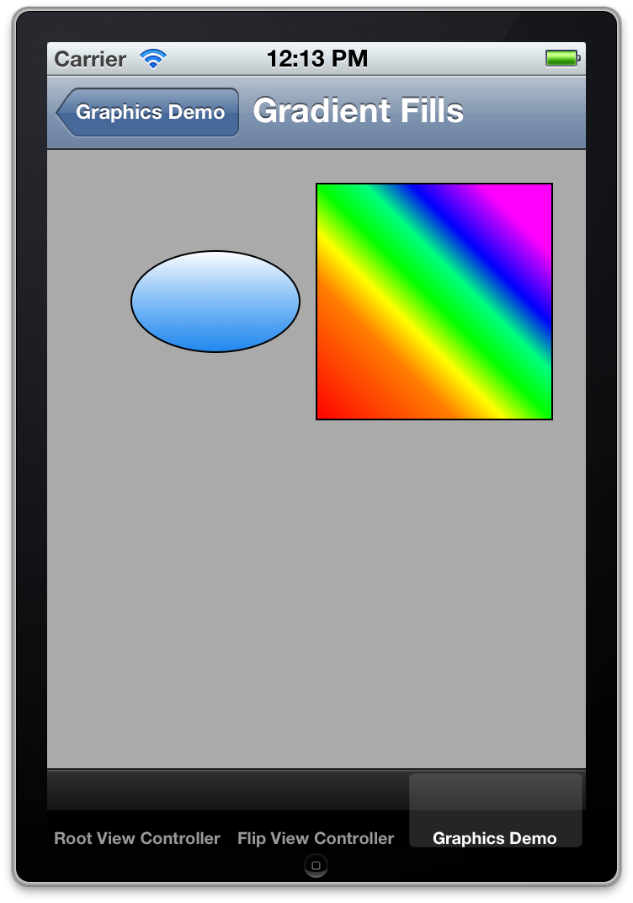
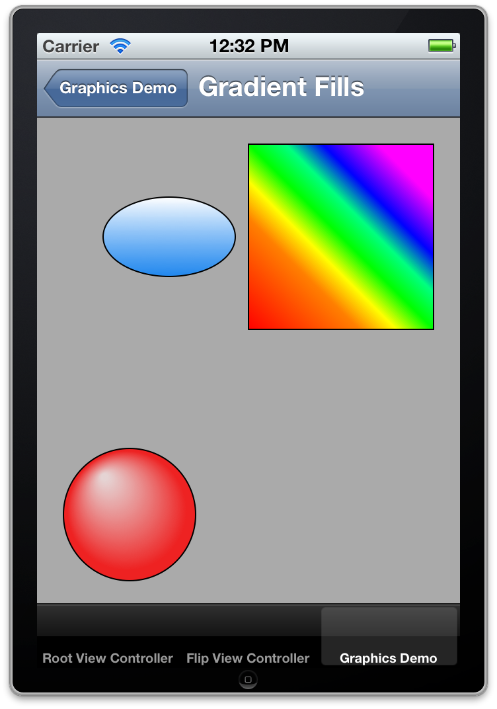
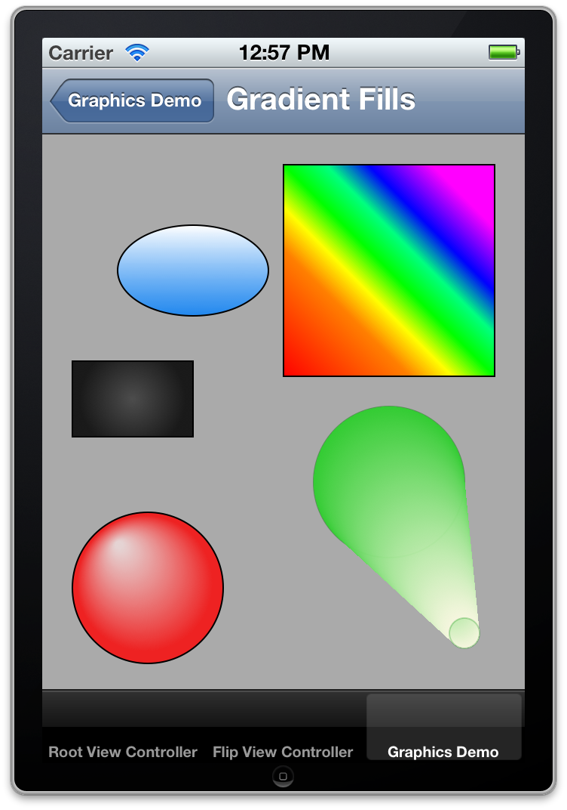
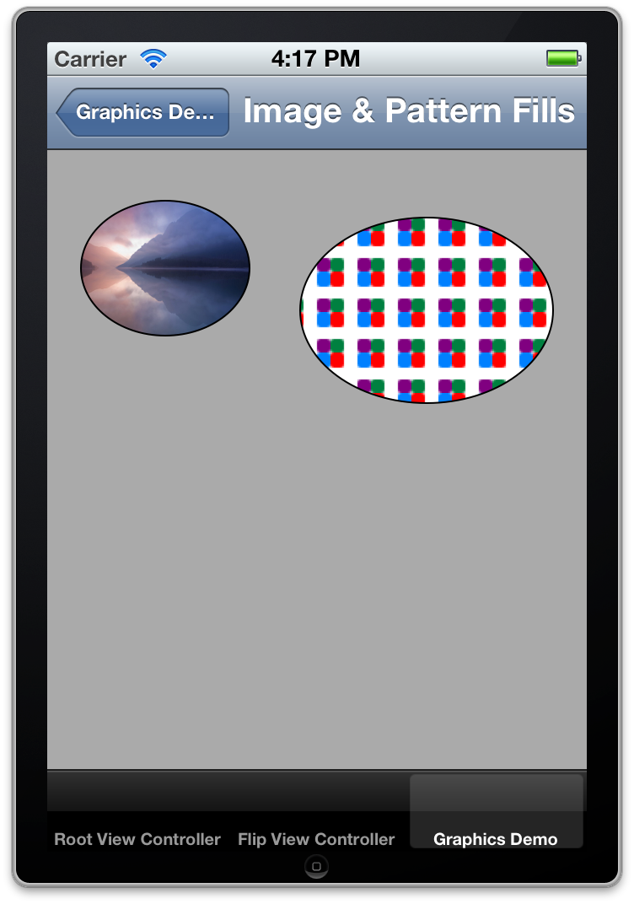

# Learn Objective-C, Building an App (Part 8): Quartz Demo 2 

This section will continue from where we left off last week. We'll work with solid fills, gradient fills, and image and pattern fills. Open up the project from last week, and let's get started. Navigate to CustomView.m 

### Single Color Fills 

In the last section we filled our paths with solid fill colors. In those cases, we started with a color defined with UIColor. In some cases, however, you may want more control. Quartz's underlying color structure is represented using a data type called CGColorRef (sometimes abbreviated to CGColor). You can create a UIColor with a CGColor and vice versa. `UIColor` has the `colorWithCGColor:` method, and instances of `UIColor` have a `.CGColor` property. For example, to create a `CGColor` that represents a bright aqua color, we could use this code: 
    
```objc
[UIColor colorWithRed:0 green:0.5 blue:1].CGColor;
```

To fill a rectangle with this color, we could use the following code: 
    
```objc
CGContextSetFillColorWithColor(context, [UIColor colorWithRed:0 green:0.5 blue:1 alpha:1].CGColor);
CGContextFillRect(context, CGRectMake(20, 30, 80, 100));
```

Remember the state-based nature of Quartz—You set a color, or a certain style, then use it. We set a fill color, then use it to paint a rectangle using `CGContextFillRect()`. There is also `CGContextStrokeRect()`. 

That's really all there is to single-color fills. You set a color, and then you fill a shape or path. 

### Gradient Fills 

A gradient fill is a fill for a shape that transitions through two or more colors. Most gradient fills are linear, where the colors fade across the entire shape along a straight line, or radial, where they fade across a radius, and the colors form concentric rings. Less common is the circular gradient, where colors transition around a circle. We'll look at the first two in this section. 

### Linear Gradient 

A *linear* or axial gradient "varies along an axis between two defined end points. All points that lie on a line perpendicular to the axis have the same color value." Let's look at an example. 

```objc
- (void)drawGradientFillsInContext:(CGContextRef)context {
    UIGraphicsPushContext(context);
    CGFloat colors[] = { 
        1.0, 1.0, 1.0, 1.0, 
        0.0, 0.5, 1.0, 0.8
    };

    CGColorSpaceRef baseSpace = CGColorSpaceCreateDeviceRGB();
    CGGradientRef gradient = CGGradientCreateWithColorComponents(baseSpace, colors, NULL, 2);
    CGColorSpaceRelease(baseSpace), baseSpace = NULL;

    CGRect rect = CGRectMake(50, 60, 100, 60);
    CGContextSaveGState(context);
    CGContextAddEllipseInRect(context, rect);
    CGContextClip(context);

    CGPoint startPoint = CGPointMake(CGRectGetMidX(rect), CGRectGetMinY(rect));
    CGPoint endPoint = CGPointMake(CGRectGetMidX(rect), CGRectGetMaxY(rect));

    CGContextDrawLinearGradient(context, gradient, startPoint, endPoint, 0);
    CGGradientRelease(gradient), gradient = NULL;

    CGContextRestoreGState(context);

    CGContextAddEllipseInRect(context, rect);
    CGContextDrawPath(context, kCGPathStroke);
    UIGraphicsPopContext();
}
```

We begin by defining the colors for our gradient. The colors are passed in as a C-style array of CGFloats consisting of color components. All colors are represented as four float values from 0.0 to 1.0, in the order Red-Green-Blue-Alpha. Here, we create a gradient that transitions from white to a partly-transparent version of the aqua color we saw above. We can create a gradient with more colors simply by adding more numbers to our colors array. 

Next, we have to grab a *color space*, which basically is a representation of the color calibration. This is more useful when displaying the same thing across different color spaces, such as the difference between the screen and a printout. The next line is what we're interested in—we get a Quartz gradient, of type CGGradientRef, by calling CGGradientCreateWithColorComponents(). This function takes four arguments. The first is the color space you got back. The second is an array of the component colors. This array should have as many items as the product of the fourth argument and the number of components the color space specifies. In this case, that would be 4. The third argument is the relative location of the colors in the gradient. Each CGFloat value must be between 0 and 1, and those values represent the location of the corresponding color in the gradient. For example, if you had four colors and you passed in [0, 0.1, 0.2, 1], the first three colors will be clustered at the start, 10% of the way along the gradient, and 20% of the way along the gradient. The last color would be at the end of the gradient. If you pass in NULL for this argument, as the code above does, the first color is assigned to location 0 (the start of the gradient), the last color is assigned to location 1 (the end of the gradient), and all other colors are equally spaced in between. The final argument is a count of the number of colors. 

In our code example, after we create the gradient, we release the color space. Quartz has its own memory management system, because we're not dealing with regular Objective-C objects. 

In the next block of code, we create a rectangle to draw with. We then call CGContextSaveGState(). This is similar to pushing and popping the graphics context, except that each context has its own state of graphics states. By pushing a new graphics state, we constrain our gradient operations to only the shape we're about to draw. We then draw the ellipse, and call CGContextClip() to clip or constrain the gradient to the outline of the shape. 

Next, we set the start and end point of the gradient. This creates a line that the gradient follows; the location of the points determines the angle of the line, and consequently the angle of the gradient. In this case, we're creating a vertical line down the center of the shape, from the top to the bottom. We then call CGContextDrawLinearGradient(), which takes five arguments. The first is the graphics context. The second is the CGGradient object we created earlier. The next two are the start and end points, and the last one is an integer that determines whether to draw the gradient's end colors beyond the end points. 

Here is another example: 
    
```objc
CGFloat rainbowColors[] = {
    1.0, 0.0, 0.0, 1.0,
    1.0, 0.5, 0.0, 1.0,
    1.0, 1.0, 0.0, 1.0,
    0.0, 1.0, 0.0, 1.0,
    0.0, 1.0, 0.5, 1.0,
    0.0, 0.0, 1.0, 1.0,
    1.0, 0.0, 1.0, 1.0
};
CGFloat locations[] = {0, 0.3, 0.4, 0.5, 0.6, 0.7, 0.85};
CGGradientRef rainbow = CGGradientCreateWithColorComponents(baseSpace, rainbowColors, locations, 7);
// CGColorSpaceRelease(baseSpace), baseSpace = NULL;
CGRect square = CGRectMake(160, 20, 140, 140);
CGContextSaveGState(context);
CGContextAddRect(context, square);
CGContextClip(context);
startPoint = CGPointMake(160, 160);
endPoint = CGPointMake(300, 20);
CGContextDrawLinearGradient(context, rainbow, startPoint, endPoint, 0);
CGGradientRelease(rainbow), rainbow = NULL;
CGContextRestoreGState(context);
CGContextAddRect(context, square);
CGContextDrawPath(context, kCGPathStroke);
```

Here, we draw a diagonal rainbow. 



*Rainbow Gradient*

### Radial Gradient 

A radial gradient "is a fill that varies radially along an axis between two defined ends, which typically are both circles. Points share the same color value if they lie on the circumference of a circle whose center point falls on the axis. The radius of the circular sections of the gradient are defined by the radii of the end circles; the radius of each intermediate circle varies linearly from one end to the other." One of the ends may be a single point rather than a circle (a point is simply a circle with a radius of 0). If one circle is partly or completely outside the other, you will end up with a cone- or cylinder-like shape. 

The code for drawing a radial gradient is similar to drawing a linear gradient. You define locations and color components and then create a `CGGradientRef` with a color space. You then call `CGContextDrawRadialGradient()` to draw the actual gradient. Let's see an example: 
    
```objc
CGFloat redBallColors[] = {
    1.0, 0.9, 0.9, 0.7,
    1.0, 0.0, 0.0, 0.8
};
CGFloat glossLocations[] = {0.05, 0.9};
CGGradientRef ballGradient = CGGradientCreateWithColorComponents(baseSpace, redBallColors, glossLocations, 2);
CGRect circleBounds = CGRectMake(20, 250, 100, 100);
startPoint = CGPointMake(50, 270);
endPoint = CGPointMake(70, 300);
CGContextDrawRadialGradient(context, ballGradient, startPoint, 0, endPoint, 50, 0);
CGContextAddEllipseInRect(context, circleBounds);
CGContextDrawPath(context, kCGPathStroke);
```

This code will draw a glossy red ball: 



*Glossy Red Ball*

In this code, we define the colors and gradient just as before. However, when drawing a radial gradient we don't need to clip to a shape, unless we wanted to; in this case, we're drawing a ball, so the default circular shape is fine for our needs. `CGContextDrawRadialGradient()` takes 7 arguments. The first two are the context and the gradient, same as before. The next two are the start point and the radius of the first circle—we'll play with that next. The next two are the end point and the radius of the second circle; we set this at 50 to create a ball with a size of 100×100. The last argument is an integer specifying whether to draw beyond the bounds. 

This example will draw a radial gradient background, clipped in a rectangle: 
    
```objc
CGFloat backgroundColors[] = {
    0.3, 0.3, 0.3, 1.0,
    0.1, 0.1, 0.1, 1.0
};
CGGradientRef backgroundGradient = CGGradientCreateWithColorComponents(baseSpace, backgroundColors, NULL, 2);
CGContextSaveGState(context);
CGRect backgroundRect = CGRectMake(20, 150, 80, 50);
CGContextAddRect(context, backgroundRect);
CGContextClip(context);
startPoint = CGPointMake(CGRectGetMidX(backgroundRect), CGRectGetMidY(backgroundRect));
CGContextDrawRadialGradient(context, backgroundGradient, startPoint, 0, startPoint, 35, kCGGradientDrawsAfterEndLocation);
CGContextRestoreGState(context);
CGContextAddRect(context, backgroundRect);
CGContextDrawPath(context, kCGPathStroke);
```

Here, we see a radial gradient constrained in a rectangle. The gradient's radius doesn't take it all the way to the edge of the rectangle, so the rest of the rectangle is filled with the end color. This is specified by the kCGGradientDrawsAfterEndLocation parameter passed to CGContextDrawRadialGradient(). 

Let's look at one last example: 
    
```objc
[[UIColor colorWithRed:0 green:0.5 blue:0 alpha:0.5] setStroke];
CGContextAddEllipseInRect(context, CGRectMake(180, 180, 100, 100));
CGContextDrawPath(context, kCGPathStroke);
CGFloat coneColors[] = {
    0.2, 0.8, 0.2, 1.0,
    1.0, 1.0, 0.9, 0.9
};
CGGradientRef coneGradient = CGGradientCreateWithColorComponents(baseSpace, coneColors, NULL, 2);
startPoint = CGPointMake(230, 230);
endPoint = CGPointMake(280, 330);
CGContextDrawRadialGradient(context, coneGradient, startPoint, 50, endPoint, 10, 0);
CGContextSetStrokeColorWithColor(context, [UIColor colorWithRed:0.1 green:0.6 blue:0.1 alpha:0.3].CGColor);
CGContextAddEllipseInRect(context, CGRectMake(270, 320, 20, 20));
CGContextDrawPath(context, kCGPathStroke);
```



*Quartz Cone*

Because the circles are partly outside of each other, Quartz draws a cone figure. 

### Image and Pattern Fills 

To make more complicated designs, sometimes it's easier to use a pre-rendered image as a fill. You may also want to repeat (tile) it to fit the area, rather than stretching it and loosing quality. 

We start by loading an image into a shape, and by clipping to the shape we can use it as a fill: 
    
```objc
CGRect ellipseRect = CGRectMake(20, 30, 100, 80);
CGContextSaveGState(context);
CGContextAddEllipseInRect(context, ellipseRect);
CGContextClip(context);
[[UIImage imageNamed:@"Image Fill.jpg"] drawInRect:ellipseRect];
CGContextRestoreGState(context);
CGContextAddEllipseInRect(context, ellipseRect);
CGContextDrawPath(context, kCGPathStroke);
```

This code is mostly old stuff. We have to clip to a shape to constrain the image to that shape; otherwise the whole image would be drawn in the entire rect. Larger images would in fact be drawn at full size, and could cover the whole screen and go beyond. We can draw the image using a method built into `UIImage`. `drawInRect:` takes a `CGRect` as its only parameter, and draws into that rectangle, filling it unless a clipping path has been defined. There is a similar way to tile images: 
    
```objc
CGRect tileRect = CGRectMake(150, 40, 150, 110);
CGContextSaveGState(context);
CGContextAddEllipseInRect(context, tileRect);
CGContextClip(context);     // Clip; otherwise whole rect will be drawn
[[UIImage imageNamed:@"TileImage.png"] drawAsPatternInRect:tileRect];
CGContextRestoreGState(context);
CGContextAddEllipseInRect(context, tileRect);
CGContextDrawPath(context, kCGPathStroke);
```

This code should be self-explanatory. The results: 



*Quartz Pattern and Image Fills*

In the next section, we'll look at more advanced things we can do with Quartz and related frameworks, including Core Animation. 

*This post is part of the [Learn Objective-C in 24 Days](38.md) course.*

---

[Previous Lesson](99.md) | [Next Lesson](102.md)
