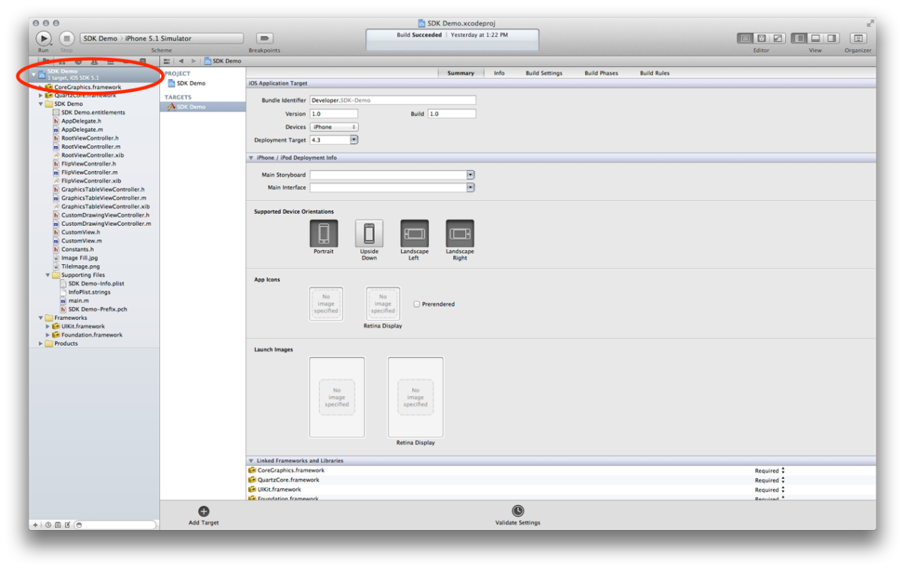
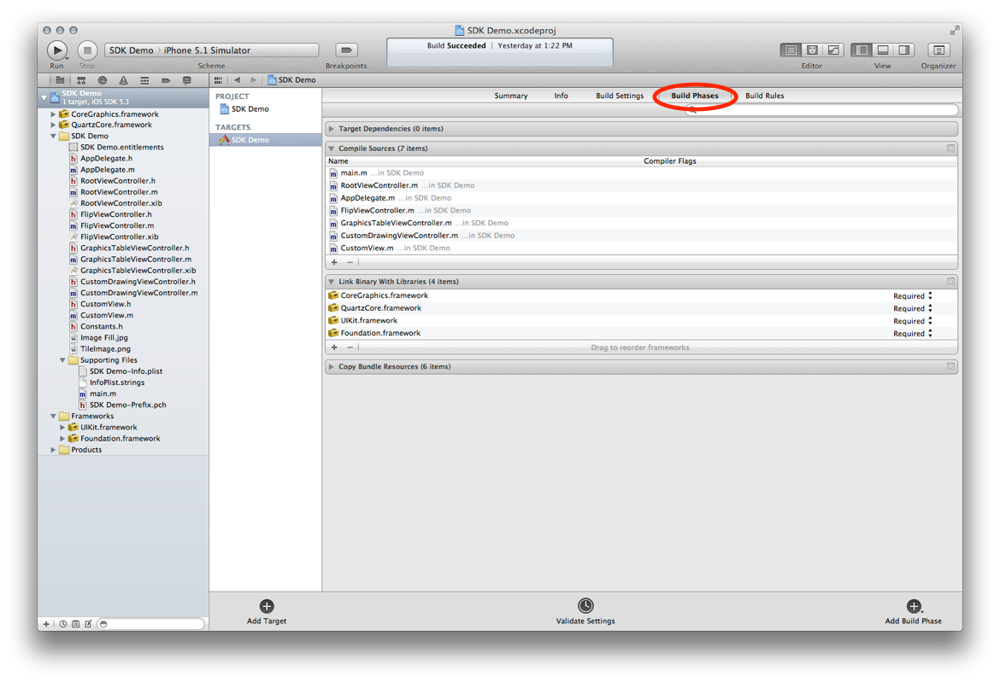
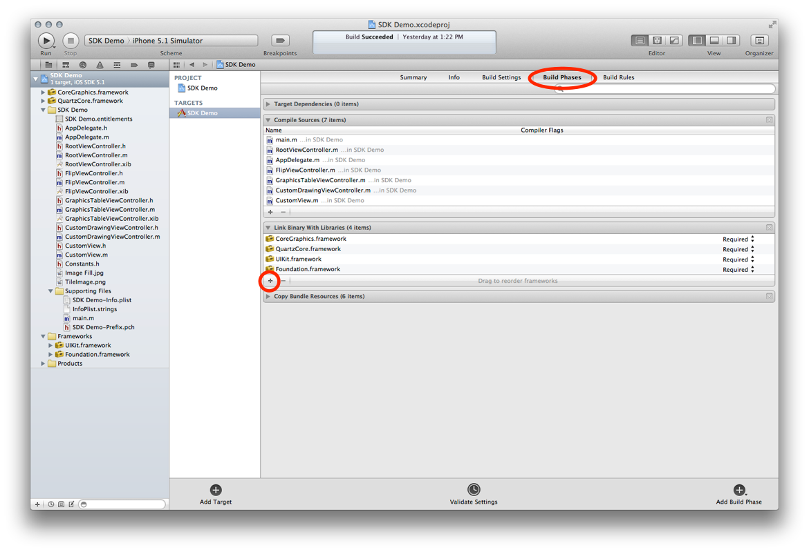
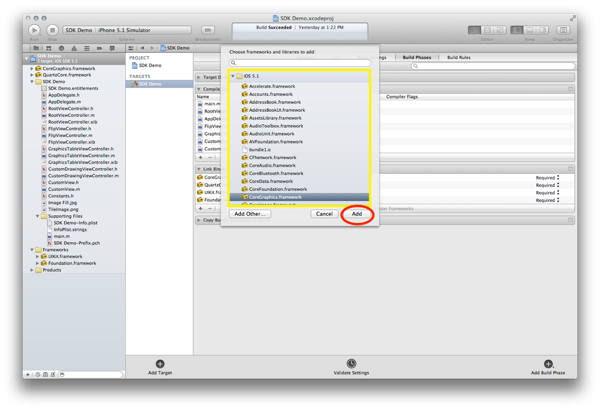

##  Learn Objective-C, Building an App: Adding Frameworks to an Xcode Project 

A lot of Xcode projects require you to add additional frameworks to link against. Here's how: 

1. Select the main project listing in the left column. 

2. Select Build Phases from the tabs near the top. 

3. Click the ' ' button in the "Link Binary With Libraries" section (you may have to twist it open. 

4. Choose the framework(s) you want to add, and click the "Add" button. 

*This post is part of the [Learn Objective-C in 24 Days](38.md) course.*

---

[Previous Lesson](98.md) | [Next Lesson](90.md)
