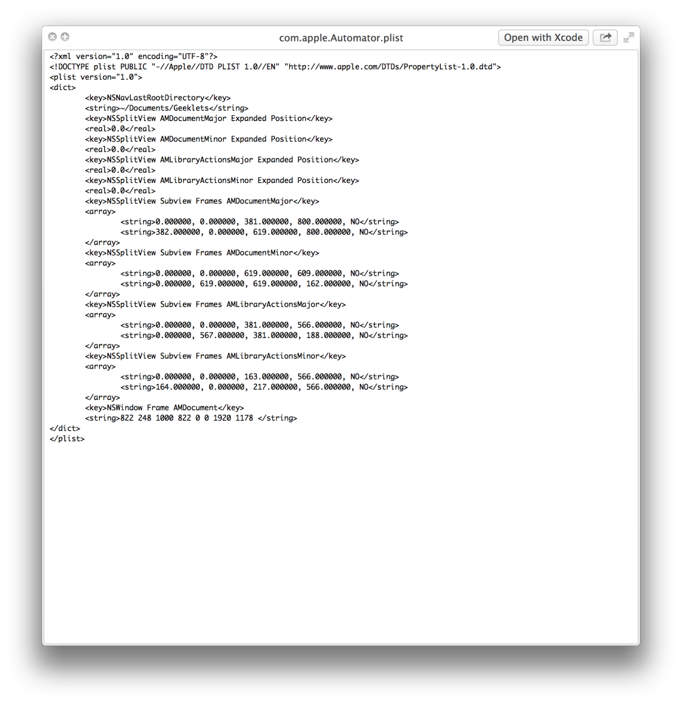
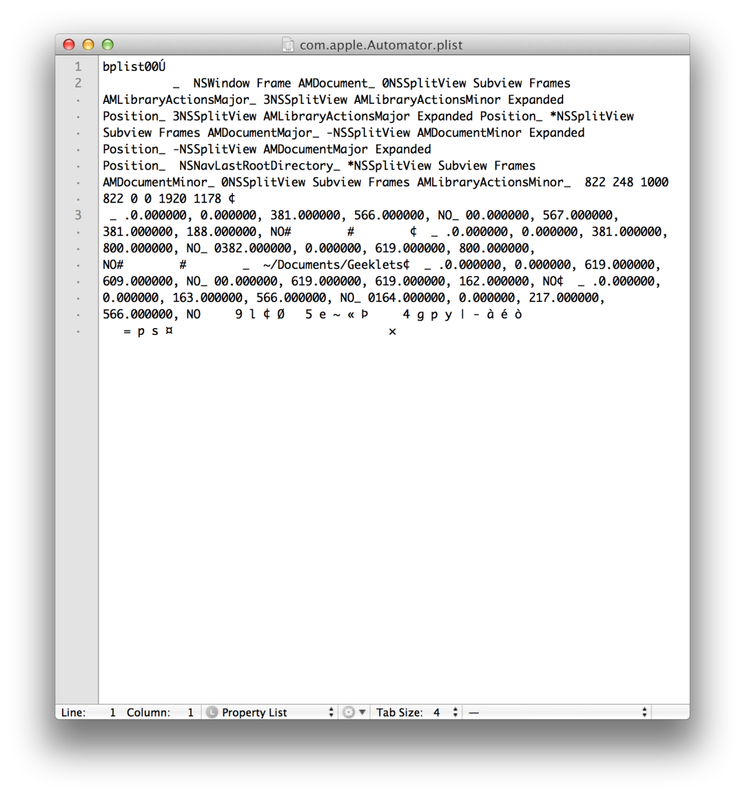

## Learn Objective-C, Building an App (Part 10): Basic Data Persistence 

Persistence is the ability to save files and content to disk, so that you can read it out later and be able to save stuff. Most apps use persistence of some sort; even if your app doesn't create files, you may still have settings and configurations you want to save. iOS provides a number of formats to save different types of data. These include user defaults, property lists (plist), archived objects, text files, XML, SQL databases, and Core Data. In this post, we'll talk about the first four formats. XML will be covered in a separate extension, as it uses additional software beyond the standard SDK, and Core Data is complex enough to be the subject of its own post. With the power and flexibility that Core Data provides, there is little need for standard SQL databases, and so we will not cover it here; there are many good tutorials on SQL on the Internet. Let's get started. 

### Building the App 

Open Xcode, create a new Single View Application, and call it "Persistence". Make sure to not use storyboards; that's a topic for another post. Open up the XIB file, and layout an interface like the one shown below. 


If you need help building the interface, check out this post, or get in touch through the comments or email. 

All UI controls are at the default settings except for the segmented control at the top, which has a third section. Make the following connections: 

* Outlet: Segmented Control as segments 
* Outlet: Progress view as progressBar 
* Outlet: Switch as cSwitch 
* Outlet: Activity Indicator as spinner 
* Outlet: Text field as textField 
* Outlet: "Start spinning" button as spinningButton 
* Outlet: Three sliders as slider1, slider2, slider3 
* Outlet: Text view as textBox 
* Action: spinningButton as toggleSpinner: 
* Action: Segmented control, switch, text field, and sliders as controlValueChanged: 
* Actions and Outlets Connection 
* Actions and Outlets Connection 


Also, make CCViewController.h the delegate of the text view. Again, if you need help, get in touch through the comments or email. You can also download the project at the end of this post. 

### Implementing the Code 

We have three methods to implement—one to toggle the spinner, one to save the state and value of most of our controls, and the delegate for the text view, where we will save the text view's contents. The first one is easy: 
    
```objc
- (IBAction)toggleSpinner:(id)sender {
    if (self.spinner.isAnimating) {
        [self.spinner stopAnimating];
        ((UIButton *)sender).titleLabel.text = @"Start spinning";
    }
    else {
        [self.spinner startAnimating];
        ((UIButton *)sender).titleLabel.text = @"Stop spinning";
    }
}
```

Here, we simply check to see if the spinner is spinning (animating), and toggle it the other way. We also update the button label to reflect its new action. 

### User Defaults 

The next method is where most of the persistence work play in. We'll check the sender argument, and save its value to an appropriate store location. 
    
```objc
- (IBAction)controlValueChanged:(id)sender {
    if (sender == self.segments)
        // Something
    else if (sender == self.cSwitch)
        // Something
    else if (sender == self.textField)
        // Something
    else if (sender == slider1)
        // Something
    else if (sender == slider2)
        // Something
    else if (sender == slider3)
        // Something
    else
        return;
}
```

In the first instance, we're going to save the selected segment into NSUserDefaults. NSUserDefaults allows you to store basic configuration information in key-value pairs. Per Apple's documentation: 

> The defaults system allows an > application to customize its behavior > to match a user's preferences. For > example, you can allow users to > determine what units of measurement > your application displays or how often > documents are automatically saved. > Applications record such preferences > by assigning values to a set of > parameters in a user's defaults > database. The parameters are referred > to as defaults since they're commonly > used to determine an application's > default state at startup or the way it > acts by default. 

The code looks like this: 
    
```objc
if (sender == self.segments) {
        int selectedSegment = ((UISegmentedControl *)sender).selectedSegmentIndex;
        [[NSUserDefaults standardUserDefaults] setInteger:selectedSegment forKey:@"SelectedSegmentIndex"];
    }
```

NSUserDefaults provides support for scalar types, so you don't have to box the integer into an NSNumber. Other NSUserDefault "setters" include: 

* `-setBool:forKey:` 

* `-setFloat:forKey:` 

* `-setInteger:forKey:` 

* `-setObject:forKey:` 

* `-setDouble:forKey:` 

* `-setURL:forKey:` 

To remove a value by key, use `-removeObjectForKey:`. 

### Plist 

Plists have been a standard way to store text and settings since the early days of Cocoa. Plist data can be either in XML or binary format, and it is possible to convert between the two formats. Although there are arguably better alternatives, plists are still a standard way of saving data in iOS and is baked into a number of Foundation classes for easy access. In this case, we’ll create a key-value dictionary and save its contents to a plist. This is the basic way of saving configuration information to plist.

Before we begin, let's look at an example plist. You can find a number of them ~/Library/Preferences.



*Plist Preview*

The plist appears to be in an XML format, but if you open the file in a text editor, you see the incomprehensible binary nature of the file. 



*Plist Binary*

In our case, we'll let `NSDictionary` handle the data transfer. NSDictionary has a `-writeToFile:atomically:` method, which writes a "property list representation of the contents of the dictionary to a given path." You can re-create the dictionary from the file using the initWithContentsOfFile: method. 

Only certain object types can be written to plists. These include instances of NSData, NSDate, NSNumber, NSString, NSArray, and NSDictionary. `-writeToFile:atomically:` will check of all objects in the dictionary are of these types; if not, the method will return NO and the file will not be written. 

To support writing this data, we need to create a mutable dictionary. Call it controlState, and add it to our controller. Then, we need to amend toggleSpinner: to save the spinner's state to the dictionary: 

```objc
- (IBAction)toggleSpinner:(id)sender {
    if (self.spinner.isAnimating) {
        [self.spinner stopAnimating];
        ((UIButton *)sender).titleLabel.text = @"Start spinning";
        [self.controlState setValue:[NSNumber numberWithBool:NO] forKey:@"SpinnerAnimatingState"];
    }
    else {
        [self.spinner startAnimating];
        ((UIButton *)sender).titleLabel.text = @"Stop spinning";
        [self.controlState setValue:[NSNumber numberWithBool:YES] forKey:@"SpinnerAnimatingState"];
    }
}
```

We're just interacting with basic NSDictionary APIs. We do something similar in the second and third cases of controlValueChanged: 
    
```objc
else if (sender == self.cSwitch)
        [self.controlState setValue:[NSNumber numberWithBool:self.cSwitch.enabled] forKey:@"SwitchEnabledState"];
    else if (sender == self.textField)
        [self.controlState setValue:self.textField.text forKey:@"TextFieldContents"];
```

Finally, we'll save the dictionary at the end of controlValueChanged:. 

```objc
NSArray *paths = NSSearchPathForDirectoriesInDomains(NSDocumentDirectory, NSUserDomainMask, YES);
    NSString *documentsDirectoryPath = [paths objectAtIndex:0];
    NSString *filePath = [documentsDirectoryPath stringByAppendingPathComponent:@"componentState.plist"];
    [self.controlState writeToFile:filePath atomically:YES];
```

We get the documents directory, and create a file path by appending the filename to the directory string. We pass it into the NSDictionary method, and tell it to write to the file atomically (writing to a temp file then renaming it to prevent data damage during the writing process—you either have the old version or the new, but nothing corrupt, in-between). 

### Archiving Objects 

Foundation provides a mechanism to save data objects as binary data through a process of encoding/decoding objects. The encoding operation supports scalar types and objects that support the [NSCoding protocol](https://developer.apple.com/documentation/foundation/nscoding?language=objc). Most Foundation data types already support this protocol. If you want to encode your own data objects, you'll want to implement NSCoding as well. `NSCoding` defines two methods, which in a data class might be implemented as follows (variables and properties are assumed to be declared already): 
    
```objc
- (void)encodeWithCoder:(NSCoder *)encoder {
    [encoder encodeObject:obj1 forKey:@"obj1Key"];
    [encoder encodeInt:anInt forKey:@"IntValueKey"];
    [encoder encodeFloat:aFloat forKey:@"FloatValueKey"];
}

- (id)initWithCoder:(NSCoder *)decoder {
    if (!(self = [super init]))
        return nil;
    obj1 = [decoder decodeObjectForKey:@"obj1Key"];
    anInt = [decoder decodeObjectForKey:@"IntValueKey"];
    aFloat = [decoder decodeObjectForKey:@"FloatValueKey"];
}
```

If your class's superclass also adopts `NSCoding`, you should call `[super encodeWithCoder:encoder]` and `[super initWithCoder:decoder]` in the respective methods. In our case, however, we are not defining a custom data class. All our archiving will be handled in the controller. Create a new `NSMutableDictionary` called sliderValues and add it as a property to the controller class. Now we add the slider values to the array as they change: 
    
```objc
else if (sender == slider1)
        [self.sliderValues setValue:[NSNumber numberWithFloat:slider1.value] forKey:@"Slider1Key"];
    else if (sender == slider2)
        [self.sliderValues setValue:[NSNumber numberWithFloat:slider2.value] forKey:@"Slider2Key"];
    else if (sender == slider3)
        [self.sliderValues setValue:[NSNumber numberWithFloat:slider3.value] forKey:@"Slider3Key"];
```

Here's how we encode the object (at the end of controlValueChanged:): 
    
```objc
NSMutableData *data = [NSMutableData data];
    NSKeyedArchiver *archiver = [[NSKeyedArchiver alloc] initForWritingWithMutableData:data];
    [archiver encodeObject:self.sliderValues forKey:@"SliderValues"];
    [archiver finishEncoding];
    NSString *dataPath = [documentsDirectoryPath stringByAppendingPathComponent:@"archivedObjects"];
    [data writeToFile:dataPath atomically:YES];
```

The archiver object is created with an instance of `NSMutableData`, and when the archive process is finished the data object contains a binary representation of the original object. This data can then be saved out to a path. 

Archiving objects is a really easy way to save relatively complex data objects to a file. However, the data is written in a binary format, and as such can only be used on OS X and iOS. Also note that a number of other classes, including `NSArray`, support writing to plist, and most Foundation data classes support data encoding. 

Finally, we have to instantiate the dictionaries; otherwise we'll be writing to a null pointer: 

```objc
- (void)viewDidLoad {
    [super viewDidLoad];
    // Do any additional setup after loading the view, typically from a nib.
    self.controlState = [NSMutableDictionary dictionary];
    self.sliderValues = [NSMutableDictionary dictionary];
}
```

### Text File 

It is relatively easy to save an `NSString` to a text file. Text files are human readable and can be made into an efficient cross-platform data source. We're going to save the contents of the text field to a string, To do that, we have to implement a `UITextViewDelegate` method. Here's the code: 
    
```objc
- (void)textViewDidChange:(UITextView *)textView {
    NSString *textViewContents = textView.text;
    NSArray *paths = NSSearchPathForDirectoriesInDomains(NSDocumentDirectory, NSUserDomainMask, YES);
    NSString *documentsDirectoryPath = [paths objectAtIndex:0];
    NSString *filePath = [documentsDirectoryPath stringByAppendingPathComponent:@"TextViewContents.txt"];
    [textViewContents writeToFile:filePath atomically:YES encoding:NSUTF8StringEncoding error:nil];
}
```

The method of interest is `writeToFile:atomically:encoding:error:` on an instance of `NSString`. The first argument is a file path, the second is a boolean, the third is one of a few constants (most of the time you'll use `NSUTF8StringEncoding`), and you can pass a pointer to an error if you want to know if anything went wrong. 

### Restoring Data 

We'll restore all the data to the controls in `viewWillAppear:`. The APIs are pretty straightforward. 
    
```objc
- (void)viewWillAppear:(BOOL)animated {
    [super viewWillAppear:animated];

    // Load segmented control selection
    int selectedSegmentIndex = [[NSUserDefaults standardUserDefaults] integerForKey:@"SelectedSegmentIndex"];
    self.segments.selectedSegmentIndex = selectedSegmentIndex;

    NSArray *paths = NSSearchPathForDirectoriesInDomains(NSDocumentDirectory, NSUserDomainMask, YES);
    NSString *documentsDirectoryPath = [paths objectAtIndex:0];

    // Load data from plist
    if ([[self.controlState allKeys] count] == 0) {
        NSString *filePath = [documentsDirectoryPath stringByAppendingPathComponent:@"componentState.plist"];
        self.controlState = [NSMutableDictionary dictionaryWithContentsOfFile:filePath];

        if ([[self.controlState objectForKey:@"SpinnerAnimatingState"] boolValue])
            [self.spinner startAnimating];
        else
            [self.spinner stopAnimating];

        self.cSwitch.enabled = [[self.controlState objectForKey:@"SwitchEnabledState"] boolValue];

        self.progressBar.progress = [[self.controlState objectForKey:@"ProgressBarProgress"] floatValue];

        self.textField.text = [self.controlState objectForKey:@"TextFieldContents"];
    }

    // Decode objects
    if ([[self.sliderValues allKeys] count] == 0) {

        NSKeyedUnarchiver *decoder = [[NSKeyedUnarchiver alloc] initForReadingWithData:data];
        self.sliderValues = [decoder decodeObjectForKey:@"SliderValues"];
        self.slider1.value = [[self.sliderValues objectForKey:@"Slider1Key"] floatValue];
        self.slider2.value = [[self.sliderValues objectForKey:@"Slider2Key"] floatValue];
        self.slider3.value = [[self.sliderValues objectForKey:@"Slider3Key"] floatValue];
    }

    // Read text file
    NSString *textViewData = [NSString stringWithContentsOfFile:[documentsDirectoryPath stringByAppendingPathComponent:@"TextViewContents.txt"] encoding:NSUTF8StringEncoding error:nil];
    self.textBox.text = textViewData;
}
```

First, we read values out of `NSUserDefaults` to restore the selected segment. Next, we get the documents path, then load the plist array using an `NSDictionary` method. We then read the values in the dictionary through the key and set the proper values on our controls. We do the same thing with the sliders, except that we have `NSKeyedUnarchiver` decode the binary data into a dictionary. Finally, we read in a text file using an `NSString` method and set the text inside the `UITextView` to that string. 

That's all there is to basic data persistence. When you quit and relaunch the app, all the settings and control values will still be there. 

Download the project [here](../code_resources/Basic%20Data%20Persistence). 

*This post is part of the [Learn Objective-C in 24 Days](38.md) course.*

---

[Previous Lesson](102.md) | [Next Lesson](104.md)
