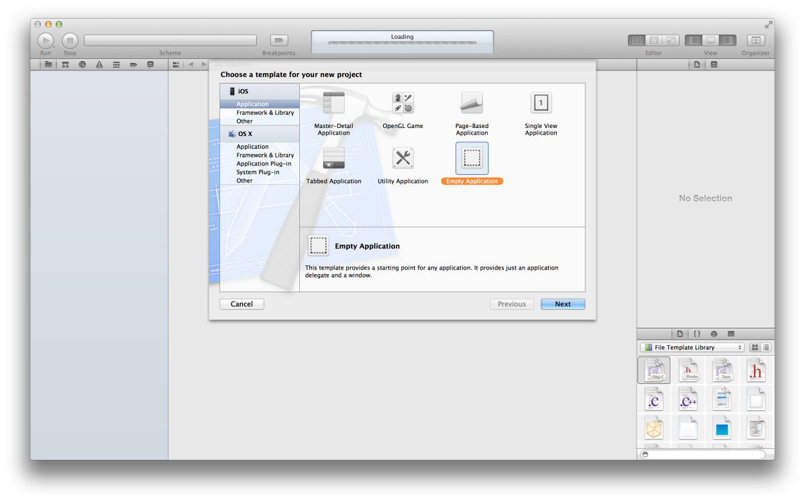
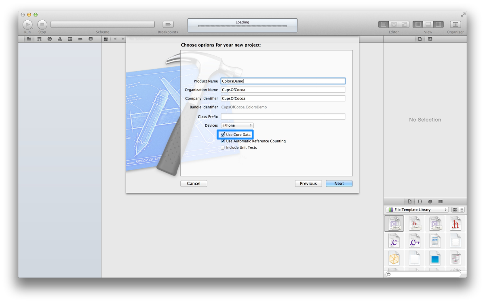
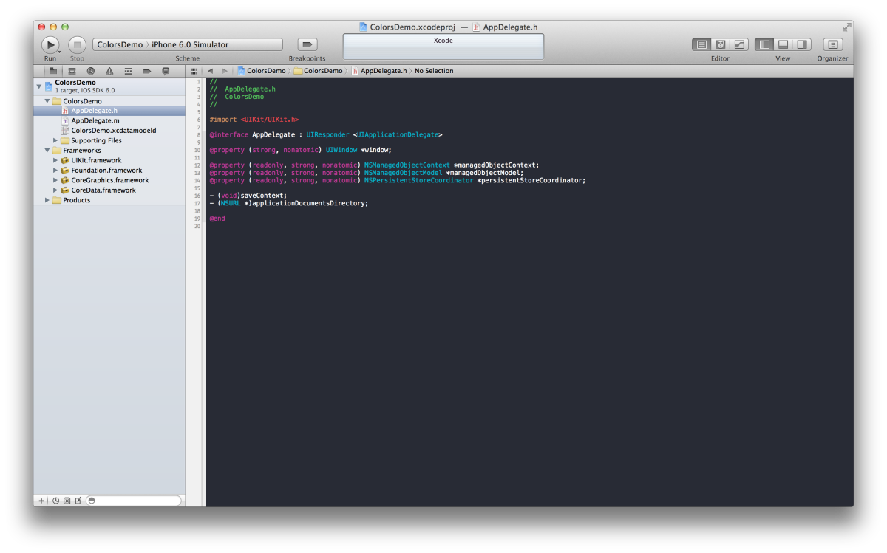
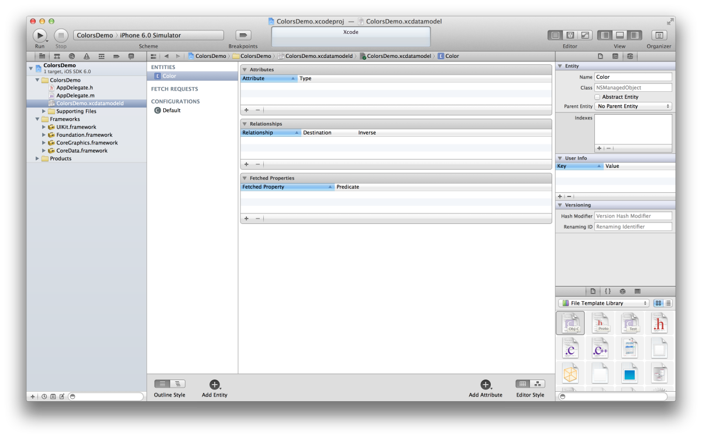
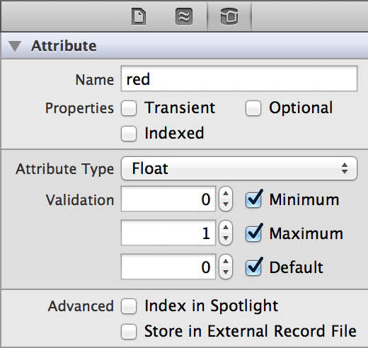
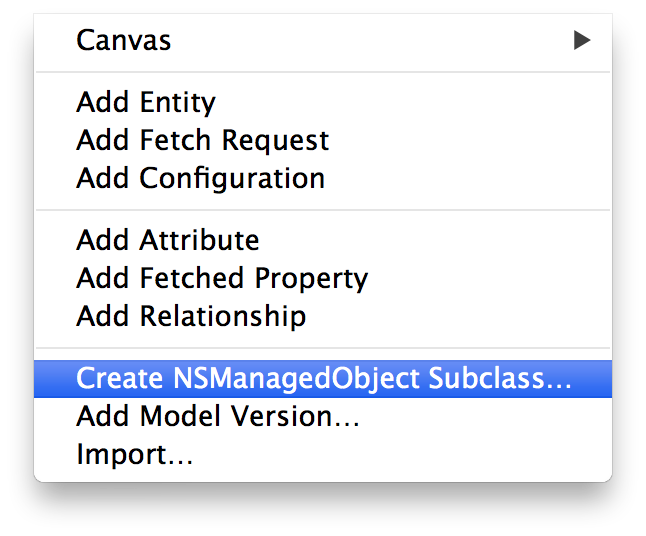
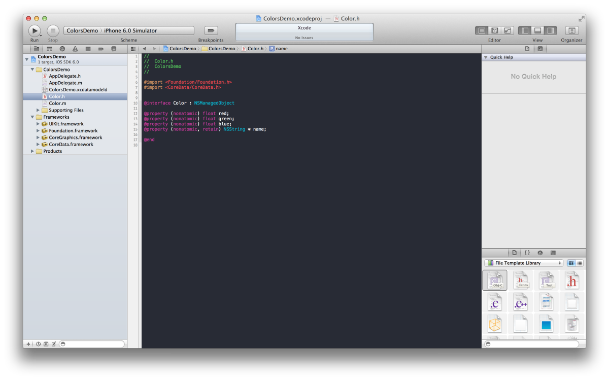
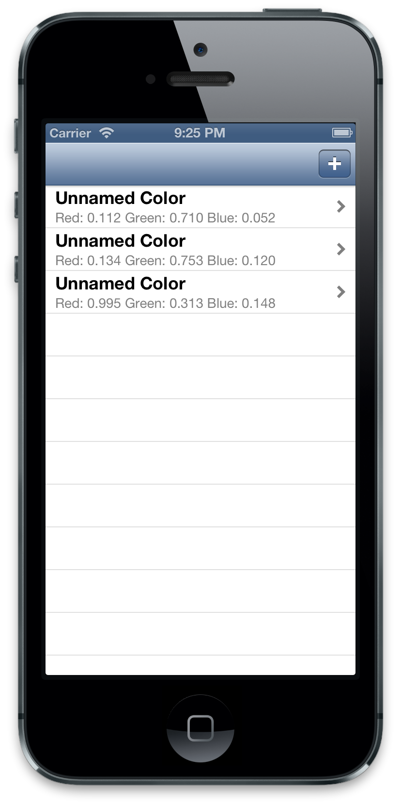
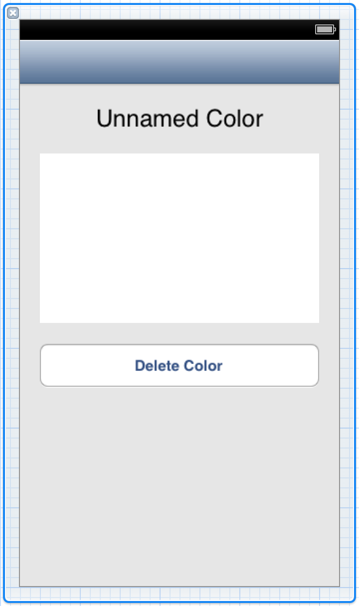
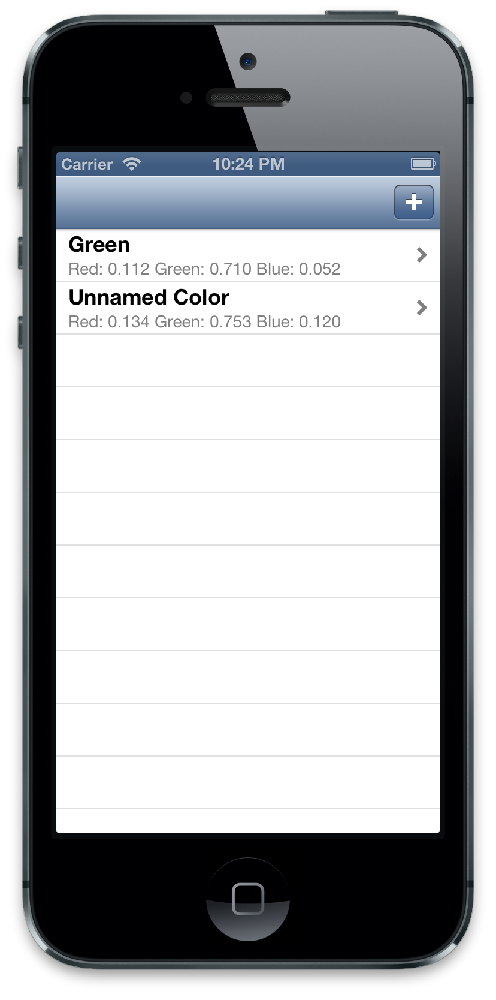

## Learn Objective-C, Building an App (Part 11): Core Data 

### Core Data 

This post will explore the depths of the Core Data API. Core Data is a technology that manages a complex SQL database, and wraps the C function calls into an object-oriented framework that is much easier to use. This database structure allows you to store complex data objects, and a lot of it—the whole system is incredibly efficient, potentially handling millions of items with ease. 

We'll create a project that creates, stores and displays a list of random colors. We will look at building the object model and the equivalent classes that result, working with objects in the database, and displaying the results in a table view. Core Data is set up to work seamlessly with the UITableViewDataSource; the data structure is almost completely in place already. 



We'll begin by creating an Empty Application. On the next screen, make sure "Use Core Data" is checked. 



The “Use Core Data” checkbox mainly does three things—it [links in the Core Data framework](101.md), creates a data model file, and creates and initializes the [Core Data stack](https://developer.apple.com/library/archive/documentation/Cocoa/Conceptual/CoreData/index.html). The stack describes the architecture of Core Data, so that’s a great a starting point.



### The Core Data stack 

Every Core Data project starts with the data model. In our app, it's called "ColorsDemo.xcdatamodeld". This file, which comes with its own editor mode, lets you define the data structure of your project, which is comprised of the classes as well as their associated properties, along with the relationships between the classes. 

The persistent object store represents the stored data file on disk; you normally don't interact with the object store. 

The persistent store coordinator is your more direct access to the data store; it is the connection to the database. Big Core Data projects can have their data model spread over several data model files; each one corresponds to an object store. The persistent store coordinator coordinates the interactions with each store file on disk; there is only one coordinator per stack. 

The managed object model represents the objects in the data store during the execution of the program. It contains information about the objects ("entities") you defined in the data store; it gets an aggregate of all the entities across all the store files from the persistent store coordinator. 

The managed object context is where a lot of the interaction with Core Data occurs. This is where objects are created, modified, and then committed to disk. Apple calls this a "scratch pad for managed objects.

### The Data Model 

Open the data model file. The editor contains a list (currently empty) of Entities (objects), Fetch Requests (you send fetch requests to find stuff in the database), and Configurations (used when you want to deal with subsets of multiple data stores. This is beyond the scope of this post). Click the ("Add Entity") button at the bottom to add an entity. An item should appear in the list, under Entities, with its name highlighted. Change the name to "Color". 



In the middle pane of the editor, you'll see an area labelled "Attributes". Here is where you define the entity's attributes, analogous to properties in regular objects. Click the plus button at the bottom left of the Attributes block to create a new attribute. It should be called red, and it should be of type Float (select from the popup menu that appears when you click on the default value, Undefined. 

In the Attributes inspector, uncheck the Optional checkbox. "Optional" indicates that the attribute doesn't have to have a value, but in our case it doesn't make sense for our color not to have a red value. Therefore, it shouldn't be Optional. You'll also see "Indexed", which means that the value should be added to the database index, which makes searching faster. However, we won't be searching by a specific color value, so we can leave it out of the index. Adding values to the index will allow searches on those values to be faster, but a large index will slow down searches in general. Therefore, add only the values you actually intend to search. You'll also see "Transient", which signifies that the attribute is not actually stored to disk, but calculated in code. Core Data doesn't make sure that the value actually is calculated; it is your responsibility to make sure that a transient attribute has a valid value when you try to access it. 

You can also specify minimum, maximum, and default values for the attribute. For our red attribute, we set a minimum value of 0 and a max of 1. This range of values represents how `UIColor` accepts color values, and simplifies things. Core Data will enforce the limits and raise an exception if you try to store a value outside of this range. The default value is simply the value that the attribute gets created with. It's not necessary to supply a default value, but it is a good idea to do so, especially for attributes that are not optional. 



Create two more attributes with the same type and properties; call them green and blue. Also create an attribute of type String; call it name. Make sure it's not Optional, that it is Indexed, and give it a default value of "Unnamed Color". You can check a string by a minimum or maximum length, but we're not going to impose length restrictions on our color names; you can also supply a [regular expression](https://www.regular-expressions.info/) to validate the input. Regular expressions (regexs) are beyond the scope of this post. 

Now we've fully defined our Color entity in the editor. We can have Xcode generate the class template for us. Make sure the Color entity is selected, then go to Editor > Create NSManagedObject Subclass…: 



Make sure "Use scalar properties for primitive data types" is checked. This setting creates ints and floats for properties rather than wrapping them up in NSNumber. This makes things faster, and because we're simply using our values to create instances of `UIColor`, there's no reason not to. Accept the default save location and click "Create". You'll see "Color.h" and "Color.m" appear in the File Inspector, and Xcode has generated property declarations for you already. 



Toggle over to Color.m, and you'll see something new: @dynamic. This is similar to @synthesize, except that the getter and setter methods aren't generated by the compiler. In fact, @dynamic tells the compiler to assume that the methods are there and ignore the warnings that it would otherwise raise about the missing methods; Core Data inserts the appropriate methods in at runtime. However, you can still write your own [getters and setters](59.md); Core Data will never override your code. 

Add a readonly property to Color of type UIColor and call it derivedColor. This property is read-only because it is actually generated from the individual color components each time it is accessed. The getter looks like this: 
    
```objc
- (UIColor *)derivedColor {
    return [UIColor colorWithRed:self.red green:self.green blue:self.blue alpha:1.0];
}
```

It would be more efficient to save a copy of the UIColor and only create a new one if the component colors were changed, but that's a level of complexity that would distract from the main purpose of this post. 

### Building the UI 

Now that we've defined the data structure, we can get around to building our UI. To do that, we'll have to create a view controller and wire it up. In fact, for this project we're going to create a navigation controller, providing room for a detail view controller which lets us explore more of what Core Data has to offer. Begin by pressing Command-N to create a new Objective-C class. Call it ColorsListViewController and make it a subclass of UITableViewController. Make sure you create the corresponding XIB as well. 

Head over to AppDelegate.m. Import ColorsListViewController.h, and then in `application:didFinishLaunchingWithOptions:`, after the "Override point for customization" comment, add the following code to initialize our view controller, create the nav stack, and add it to the main window: 
    
```objc
ColorsListViewController *mainVC = [[ColorsListViewController alloc] init];
UINavigationController *navVC = [[UINavigationController alloc] initWithRootViewController:mainVC];
self.window.rootViewController = navVC;
```

Next, we're going to create a button that will create a new random color and add it to the table. Add the following code to viewDidLoad: 
    
```objc
UIBarButtonItem *plusButton = [[UIBarButtonItem alloc] initWithBarButtonSystemItem:UIBarButtonSystemItemAdd target:self action:@selector(addNewColor:)];
self.navigationItem.rightBarButtonItem = plusButton;
```


We're creating a standard plus button (like the one you see in the Contacts app), binding it to the `addNewColor:` method (which we'll be defining in just a moment), and adding it to the right position in the nav bar. 

Next, add the method declaration for `addNewColor:` to the header file and the following implementation: 
    
```objc
- (IBAction)addNewColor:(id)sender {
    AppDelegate *ad = (AppDelegate *)[[UIApplication sharedApplication] delegate];
    NSManagedObjectContext *moc = ad.managedObjectContext;
    Color *newColor = (Color *)[NSEntityDescription insertNewObjectForEntityForName:@"Color" inManagedObjectContext:moc];
    newColor.red = [self randomColorComponentValue];
    newColor.green = [self randomColorComponentValue];
    newColor.blue = [self randomColorComponentValue];
    NSError *error;
    if (![moc save:&error]) {
        // Something's gone seriously wrong
        NSLog(@"Error saving new color: %@", [error localizedDescription]);
    }
    [self.colorsArray addObject:newColor];
    [self.tableView reloadData];
}
```

Make sure to import AppDelegate.h and Color.h. You'll also need to declare colorsArray as a property of type NSMutableArray. We're also using a helper method to generate a random number between 0 and 1. In this method, arc4random() returns a value between 0 and 2^32-1, so we divide the return value by 2^32-1 (equivalent to 100000000 in [hexadecimal](https://en.wikipedia.org/wiki/Hexadecimal)). 

```objc
- (double)randomColorComponentValue {
    return ((double)arc4random() / 0x100000000);
}
```

Let's take a look at what `addNewColor:` is doing. We get a reference to our app delegate because that's where our managed object context is (Xcode's Core Data template created the object for us. If you're interested in where the object comes from, take a look at AppDelegate.m). We then get the managed object context itself. Next, we create a new instance of Color by adding a new object to the database. This is an important paradigm to understand. 

The `insertNewObjectForEntityForName:inManagedObjectContext:` method takes the name of the entity (our data model class) as its first argument, and the managed object context as its second. The method returns an object of type id; we cast it to an instance of Color. We then set the color components to a random value, and then save the color to our database using the managed object context. If save: fails, the method returns NO and our error will be set to something appropriate. It is a serious issue if the save fails; depending on the situation, the app should try again, ask the user to try again, or simply choose to crash if the data is unrecoverable and the app can't continue without it (an extreme case). In this case, we just log the error. The rest of the method is simple: we also add the color object to the array that backs the table view, and then reload the table view. 

Next, we're going to populate our colorsArray in viewDidLoad so it contains data from whatever is already stored on disk. After alloc/initing the array, add the following code: 
    
```objc

    NSEntityDescription *entity = [NSEntityDescription entityForName:@"Color" inManagedObjectContext:moc];
    NSFetchRequest *request = [[NSFetchRequest alloc] init];
    [request setEntity:entity];
    NSSortDescriptor *sortDescriptor = [[NSSortDescriptor alloc] initWithKey:@"name" ascending:YES];
    NSArray *sortDescriptors = [NSArray arrayWithObject:sortDescriptor];
    [request setSortDescriptors:sortDescriptors];
    // Fetch the records and handle an error
    NSError *error;
    self.colorsArray = [[moc executeFetchRequest:request error:&error] mutableCopy];
    if (!self.colorsArray) {
        // This is a serious error
        // Handle accordingly
        NSLog(@"Failed to load colors from disk");
    }Now it's elementary to set up our table view data source methods: 

- (NSInteger)numberOfSectionsInTableView:(UITableView *)tableView {
    return 1;
}

- (NSInteger)tableView:(UITableView *)tableView numberOfRowsInSection:(NSInteger)section {
    return [self.colorsArray count];
}

- (UITableViewCell *)tableView:(UITableView *)tableView cellForRowAtIndexPath:(NSIndexPath *)indexPath {
    static NSString *cellID = @"CellID";
    UITableViewCell *cell = [tableView dequeueReusableCellWithIdentifier:cellID];
    if (!cell) {
        cell = [[UITableViewCell alloc] initWithStyle:UITableViewCellStyleSubtitle reuseIdentifier:cellID];
        cell.accessoryType = UITableViewCellAccessoryDisclosureIndicator;
    }
    Color *currentColor = [self.colorsArray objectAtIndex:indexPath.row];
    cell.textLabel.text = currentColor.name;
    cell.detailTextLabel.text = [NSString stringWithFormat:@"Red: %.3f Green: %.3f Blue: %.3f", currentColor.red, currentColor.green, currentColor.blue];
    return cell;
}
```

There's nothing new here; we're just pulling values from our colorsArray and setting the text labels in our table view cell. 

Build and run the app. You'll be presented with a blank table view. Press the " " button a couple of times, and new entries will appear in the table. Now, you can quit the app, and when you relaunch the entries will be right as you left them. That's the persistent nature of Core Data at work. 



### Building the Detail View 

We've played around with the basics of Core Data, but we can do more. We're going to build a detail view that allows us to edit color names, see what our color looks like, and delete colors. Changes that we make will be written back to the database. Let's get started by creating a subclass of UIViewController, call it DetailedColorViewController, and make sure to create the XIB as well. 



The UI should look something like this. The first element is actually a borderless text field, with the text centered and set to size 24. In the middle is a generic `UIView`; we can change the background color to reflect the actual color that we're representing. Finally, we have a button that will delete the color. 

Declare these two methods in the header. Wire up the first one to the text field's Did End on Exit event, and the second to the button's Touch Up Inside event. 
    
```objc
- (IBAction)didChangeColorName:(id)sender;
- (IBAction)deleteColor:(id)sender;
```

Also declare a property (strong, nonatomic) of type Color, called color, and import Color.h. Synthesize the property in the implementation file. The text field should also be hooked up to a corresponding property called nameField, and the basic view should be hooked up to a corresponding property called colorView. Make sure both are strong and nonatomic, and that both are IBOutlets. 

A few lines of code are needed in viewDidLoad to set up the view. 
    
```objc
self.title = @"Inspect Color";
self.nameField.text = self.color.name;
self.colorView.backgroundColor = self.color.derivedColor;
```

Next, we're going to implement the delete method. Again, the managed object context is our point of interaction, and the code is pretty simple. Ideally, you'd like to prompt the user with an action sheet to confirm the delete action, but for simplicity's sake we're simply going to go ahead with the delete here. 

```objc
- (IBAction)deleteColor:(id)sender {

    [moc deleteObject:self.color];
    [moc save:nil];
    [self.navigationController popViewControllerAnimated:YES];
}
```

We first get the managed object context (make sure to import AppDelegate.h). Then we simply call deleteObject:, passing the Color object we're referring to here. We save the changes to disk; for simplicity's sake we won't concern ourselves with any errors. Then, we pop to the list view because our detail view is now referring to a Color that no longer exists. 

Updating a managed object is as simple as updating the properties you want, and then saving the changes through the managed object context. NSManagedObject associates each object with a managed object context, which makes Core Data interactions much simpler. 
    
```objc
- (IBAction)didChangeColorName:(id)sender {
    self.color.name = self.nameField.text;
    [sender resignFirstResponder];

    [moc save:nil];
}
```

A detail worth pointing out: The color's name is set to the value stored in our nameField, because that's the purpose of the name field. However, resignFirstResponder (which dismisses the keyboard) is called on the sender. This allows our method to be more modular; we could connect the method to other (or even multiple) UI elements and it would still behave properly. 

Now all we have to do is support the detailed view controller in our list view controller. Head back over to ColorsListViewController.m. Import DetailedColorViewController.h and implement the relevant delegate method: 
    
```objc
- (void)tableView:(UITableView *)tableView didSelectRowAtIndexPath:(NSIndexPath *)indexPath {
    DetailedColorViewController *dcvc = [[DetailedColorViewController alloc] init];
    dcvc.color = [self.colorsArray objectAtIndex:indexPath.row];
    [self.navigationController pushViewController:dcvc animated:YES];
}
```

In viewWillAppear, we'll refresh our table view because changes could have been made in the detailed view controller. 
    
```objc
- (void)viewWillAppear:(BOOL)animated {
    [super viewWillAppear:animated];
    [self.tableView reloadData];
}
```

Build and run the app. Try changing a color name, hitting Return on the keyboard and going back to the list view. The entry will update to reflect your new name. Try deleting an entry and going back to the list view. In fact, you'll notice that we end up with an entry without a name, where all the color components are 0. This is because our colorsArray wasn't updated with the change. It still holds three items, although one of them is now effectively nil. Quitting and restarting the app will fix the issue, but we can fix it in code as well. Simply move the code in viewDidLoad fetching from disk (from getting the managed object context to the error handling if colorsArray is nil) into a separate method called fetchColorsFromDisk, and call that method at the end of viewDidLoad, and right before reloading the table view in viewWillAppear: 



As you can see, Core Data provides an easy way to save data to disk. There is some initial architecture to sort through (although the Core Data template helps a bunch—see AppDelegate.m for all the rest of the code), but Core Data makes it incredibly easy to propagate changes to disk. Most of our code was UI code, presenting the information on disk. 

Core Data's real power comes from its speed and searching ability. You can handle databases of thousands of objects without perceived lag, and you have very powerful search tools at your disposal. Core Data also provides a way for you to migrate to future data model versions if you ever decide to change the way the data is represented. There's a lot more to Core Data, but hopefully this was a helpful introduction! There will be more posts on Core Data in the future. 

*This post is part of the [Learn Objective-C in 24 Days](38.md) course.*

---

[Previous Lesson](103.md) | [Next Lesson](105.md)
