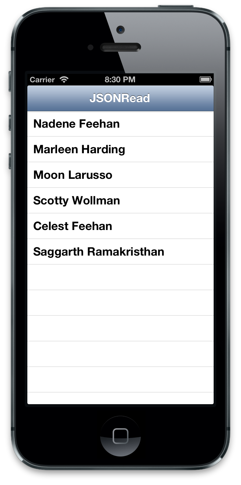
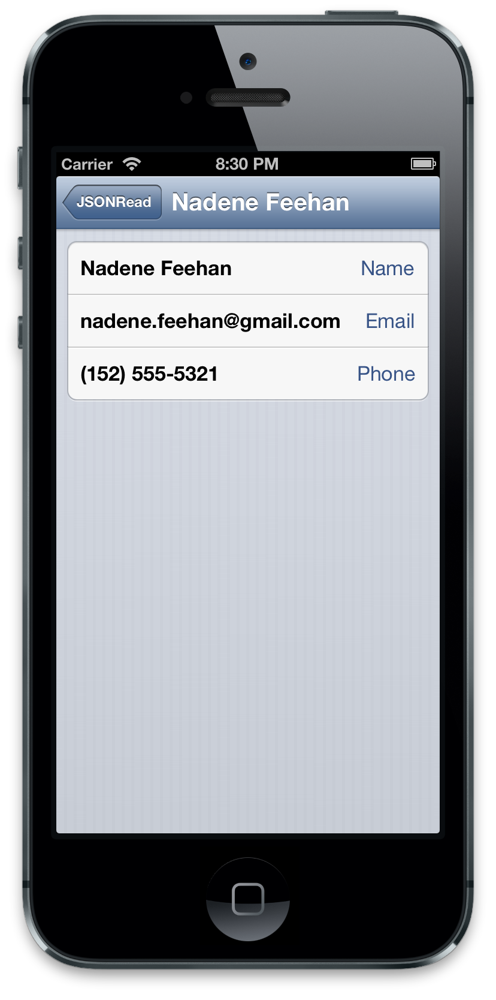

# Learn Objective-C, Building an App (Part 12): Working With Web Data 

Apps become a lot more interesting when we connect them to the internet. They're able to fetch live data, update that data, and interact with other people and devices. In this post, we'll look at how to pull data from the internet. 

We'll be working with JSON data. JSON, which stands for JavaScript Object Notation, is one of two popular formats for reading general data from the web (XML is the other). JSON has the advantage of being a lot more terse than XML, and is a lot easier for websites themselves to work with. iOS includes libraries to work with both data types. 

Let's begin by creating a new project- I'll call it JSONRead- and making our main view controller a subcontroller of UITableViewController. We'll begin by reading JSON data from the web, parsing it, and saving it to a data object in our controller. In fact, here is the JSON we'll be using (see below for more on the JSON syntax and how to generate it): 
    
```json
[
    {
        "fname": "Nadene",
        "lname": "Feehan",
        "email": "nadene.feehan@gmail.com",
        "phone": "(152) 555-5321"
    },
    {
        "fname": "Marleen",
        "lname": "Harding",
        "email": "marleen@mharding.com",
        "phone": "(134) 555-1134"
    },
    {
        "fname": "Moon",
        "lname": "Larusso",
        "email": "lunarguy@hotmail.com",
        "phone": "(123) 456-5432"
    },
    {
        "fname": "Scotty",
        "lname": "Wollman",
        "email": [
            "scotty@wollman.com",
            "beammeup@gmail.com",
            "s.wollman@bigcorp.com"
        ],
        "phone": "(152) 555-5321"
    },
    {
        "fname": "Celest",
        "lname": "Feehan",
        "email": "celestial@gmail.com",
        "phone": "(098) 765-4321"
    },
    {
        "fname": "Saggarth",
        "lname": "Ramakristhan",
        "email": "sagar@gmail.com",
        "phone": "(012) 345-4321"
    }
]
```

Next, in the .m file, we'll define a link to the file, and a private interface to hold our properties: 
    
```objc
#define JSON_FILE_URL @"https://raw.githubusercontent.com/Binpress/learn-objective-c-in-24-Days/master/Working With Web Data/JSONRead.json"

@interface PeopleListViewController ()
@property (strong, nonatomic) NSArray *names;
@property (strong, nonatomic) NSArray *data;
@end
```

Synthesize these properties. Next, we'll load the data and parse it into basic data types in `viewDidLoad` 
    
```objc
- (void)viewDidLoad {
    [super viewDidLoad];
    self.title = @"JSONRead";

    // Download JSON
    NSData *JSONData = [NSData dataWithContentsOfURL:[NSURL URLWithString:JSON_FILE_URL]];
    // Parse JSON
    NSArray *jsonResult = [NSJSONSerialization JSONObjectWithData:JSONData options:kNilOptions error:nil];
    self.data = jsonResult;
    NSMutableArray *_names = [NSMutableArray array];
    for (id item in jsonResult)

    self.names = _names;
}
```

Downloading data from the internet starts by creating an NSURL (which can be instantiated from an NSString), then getting an instance of NSData from that URL. We then use a method that Apple has provided since iOS 5.0 to parse the JSON. Note that we're casting to NSArray- NSDictionary is another common option, and we'll talk about how to tell which to use below. Finally, we simply loop through each element in the array, and pull out certain properties to generate an array of names, which we display in our table view. In this case, each element in the parsed array is a dictionary, so we're using the new [literal syntax](https://stackoverflow.com/a/9349981/472768) to access a key-value pair in each item. 

Our table view data source is pretty simple—one section, with as many rows as we have names. Our table view cells display the names that correspond to the indexPath.row, and in the delegate, when you select a cell we create a detail view controller (make sure to import the header), pass in the item from our data array that corresponds to the selected indexPath.row, and push the detail view controller onto the navigation stack. 
    
```objc
- (NSInteger)numberOfSectionsInTableView:(UITableView *)tableView {
    // Return the number of sections.
    return 1;
}

- (NSInteger)tableView:(UITableView *)tableView numberOfRowsInSection:(NSInteger)section {
    // Return the number of rows in the section.
    return [self.names count];
}

- (UITableViewCell *)tableView:(UITableView *)tableView cellForRowAtIndexPath:(NSIndexPath *)indexPath
{
    static NSString *CellIdentifier = @"Cell";
    UITableViewCell *cell = [tableView dequeueReusableCellWithIdentifier:CellIdentifier];
    if (!cell)
        cell = [[UITableViewCell alloc] initWithStyle:UITableViewCellStyleDefault reuseIdentifier:CellIdentifier];

    cell.textLabel.text = self.names[indexPath.row];

    return cell;
}

- (void)tableView:(UITableView *)tableView didSelectRowAtIndexPath:(NSIndexPath *)indexPath {
    // Navigation logic may go here. Create and push another view controller.
    PeopleDetailsViewController *detailViewController = [[PeopleDetailsViewController alloc] initWithStyle:UITableViewStyleGrouped];
    detailViewController.details = self.data[indexPath.row];
    [self.navigationController pushViewController:detailViewController animated:YES];
}
```

### JSON Format 

JSON begins with key-value pairs: 
    
```json
"fname": "Nadene"
```

These values can be an integer or floating point, string, boolean (true or false), array, object, or null. A list of key-value pairs is separated by a comma. 

JSON values can be an array- a list of values (any of the above values are valid in an array) wrapped in square brackets. Our JSON sample is in fact a single array, as shown by the starting and ending brackets, and this knowledge allows us to choose NSArray as the object that the JSON gets parsed to. 

JSON values can also be an object (objects in a Javascript context), which is rather like a grouped set of key-value pairs, wrapped in curly braces. Groups are used in our sample JSON to group the key-value pairs of each person as a separate element inside the array. 

So for our sample JSON, we have a single array containing six objects. Each object has four key-value pairs, and for Scotty, he has an array for his email addresses, signifying that he has multiple emails. 

### Detail view 

The details view controller is also a subclass of `UITableViewController`, with an NSDictionary for the details which we pass in: 

```objc
@interface PeopleDetailsViewController : UITableViewController
@property (strong, nonatomic) NSDictionary *details;
@end
```

We define a simple method to generate a name based on the person's first name and last name 
    
```objc
- (NSString *)name {
    return [NSString stringWithFormat:@"%@ %@", self.details[@"fname"], self.details[@"lname"]];
}
```

and use it to set the title in viewDidLoad 
    
```objc
- (void)viewDidLoad {
    [super viewDidLoad];
    self.title = [self name];
}
```

Our table view data source is, again, pretty simple—1 section, 3 rows, and specific content for each row: 
    
```objc
- (NSInteger)numberOfSectionsInTableView:(UITableView *)tableView {
    // Return the number of sections.
    return 1;
}

- (NSInteger)tableView:(UITableView *)tableView numberOfRowsInSection:(NSInteger)section {
    // Return the number of rows in the section.
    return 3;
}

- (UITableViewCell *)tableView:(UITableView *)tableView cellForRowAtIndexPath:(NSIndexPath *)indexPath {
    static NSString *CellIdentifier = @"Cell";
    UITableViewCell *cell = [tableView dequeueReusableCellWithIdentifier:CellIdentifier];
    if (!cell)
        cell = [[UITableViewCell alloc] initWithStyle:UITableViewCellStyleValue1 reuseIdentifier:CellIdentifier];

    switch (indexPath.row) {
        case 0:
            cell.textLabel.text = [self name];
            cell.detailTextLabel.text = @"Name";
            break;
        case 1: {
            NSString *email = [details objectForKey:@"email"];
            if (!email)
                email = @"No email";
            if ([email isKindOfClass:[NSArray class]])
                email = @"<Multiple emails>";
            cell.textLabel.text = email;
            cell.detailTextLabel.text = @"Email";
            break;
        }
        case 2:
            cell.textLabel.text = self.details[@"phone"];
            cell.detailTextLabel.text = @"Phone";
            break;
        default:
            break;
    }

    return cell;
}
```

This is all the code we need. Click Run, and we'll see a simple contact manager. 





### Generating JSON 

A JSON string is valid Javascript syntax, so it can be used as a Javascript object or array. To turn a string into Javascript, use JSON.parse(text, function(key, value)); to convert an object into a JSON string, use JSON.stringify(object). jQuery also allows you to serialize() a form, which you can then pass to a server. This is really useful when you want to submit a form via AJAX. 

In Ruby, the new hash notation is the same as JSON, which makes things easier. object.to_json will create a JSON string out of an object, and JSON.parse(object) will create an object from JSON. 

In PHP, json *encode() takes an object or array (linear or associative) and returns a JSON string. json* decode() will return an object or linear array depending on the JSON; an optional second parameter allows you to force an associative array where it would otherwise return an object. 
 
Download the project [here](../code_resources/Working%20With%20Web%20Data).

*This post is part of the [Learn Objective-C in 24 Days](38.md) course.*

---

[Previous Lesson](104.md) | [Home Page](38.md)
