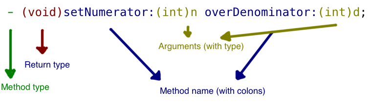

## Learn Objective-C: Methods (in Detail)

*The majority of the following text is derived from Apple’s authoritative guide on the Objective-C language- [The Objective-C Programming Language](https://developer.apple.com/library/archive/documentation/Cocoa/Conceptual/ObjectiveC/Introduction/introObjectiveC.html): Chapter 1: Objects, Classes, and Messaging.*

### Message Syntax

You send a message to an object to have it do something. As the caller, you don’t really care how the object does the work (if you wrote the class in the first place, you assure yourself that the method will work, and you don’t worry about it when you call the method later). To call a method, you enclose the call in square brackets, and use the following format:

```objc
[receiver message];
```

The receiver must be an object; the method is an instruction, possibly along with *arguments*. At compile time, a method is simple a name of a set of instructions. The compiler simply checks that the method exists. Only at runtime, the correct method is selected from the receiver object’s repertoire, and follows the instructs. The method name “selects” a method implementation (this will be furthered explored with the concepts of *polymorphism* and *dynamic binding*. Methods are sometimes referred to as selectors; in fact, there are entities that represent a method variable (that is, a data type that can be assigned a method), which you can pass to certain methods. The Objective-C language defers as much as possible to runtime rather than compile time; this will lead to some subtle matters and issues that will be further explored in later lessons.

If you have any experience in procedural languages (such as the venerable C), methods are similar to functions. However, a function is a global sequence of steps that can be called anywhere to do something. A function is also an entity that is defined at compile time—it’s like a machine that (potentially) takes an input and returns an output, or at least does some (useful) work. In contrast, a method is bound to a class; it’s like asking a co-worker to do something—every object has a list of methods it can perform, and no other. In short, functions are global machines; methods are bound to a class, and constitute a portion of the class.

### Arguments

Arguments to a method are parameters or values passed to a method so that the method gets access to those values without breaking encapsulation and having a massive collection of global values.

A method with one argument includes a color at the end of the method name and the argument immediately follows the colon (yes, you can put a space there, but nothing else). For example, the following method is an example of argument usage:

```objc
[myFraction setNumerator:2];
```

The argument can be a constant, as in the previous example, or a variable of the corresponding type, as declared in the method declaration. The declaration for the setNumerator: method would be

```objc
- (void)setNumerator:(int)value;
```

In general, methods with arguments are declared like this: 


Notice how the arguments are interspersed within the method name. This is very different from other languages, where the arguments are in a comma-separated list after the method name. One of Objective-C’s design goals is to make the code read like English; this is effectively accomplished by directly relating the method arguments to the portion of the method. For longer methods where you may have half a dozen arguments, this can be extremely helpful.

When calling such methods, the syntax is the same as above; simply follow each colon with a variable or constant for the argument.

The name of such methods include the colons. Therefore, the selector name for the method above would be setNumerator:overDenominator:.

These parts of the method are not optional, nor can their order be varied. The final portion of the method must also take an argument:

[Why must the last part of an Objective-C method name take an argument (when there is more than one part)?
](https://stackoverflow.com/questions/4479967/why-must-the-last-part-of-an-objective-c-method-name-take-an-argument-when-ther)

Note, too, that you can nest message calls; these work like parentheses in math—the innermost method is evaluated, and then its return value (if the inner method(s) don’t return a value, you really can’t nest them) is used as the receiver or argument to another message. For example,

```objc
[[myDatabase generateNewDatabase] addObject:[NSString stringWithFormat:@"Hello, %@", myPerson.name]]];
```

Is a perfectly valid statement. Try to trace through the method calls (remember that the use of the dot syntax is also a method call). Xcode will automatically keep track of those brackets for you; as you close one, it’ll highlight the corresponding one, so you’ll know where you are. The compiler will warn you too.

One final point about arguments: methods can take more than one argument, but it’s rare. These methods are rather difficult to implement (you don’t want to skip any arguments, but you don’t want to read more arguments than you’re provided with—you’d be reading in garbage values), and are beyond the scope of where I’d like to venture. However, Matt Gallagher at his blog Cocoa with Love details using methods with multiple arguments:

[Variable argument lists in Cocoa](http://www.cocoawithlove.com/2009/05/variable-argument-lists-in-cocoa.html)

### Messages to nil

It is perfectly valid to send a message to nil in Objective-C.

To clarify, nil is a defined value, not just garbage. In a system’s memory, you never know what’s in a specific block of memory until you actually assign it anything. This is known as “garbage” memory. Nil (which is simply a redefinition of the classic NULL) is (typically) defined as zero. The statement

```objc
NSString *s;
```

Simply says that there will be an object of type NSString called “s”; it does not imply any value. If you tried to access “s” at the moment, barring any compiler issues or warnings, you will get garbage values. Run it a couple of times, and you will get different values back. That’s because the system is reading a block of memory that still contains data from whatever used that block before. However, if you had said `NSString *s = nil;`, “s” still wouldn’t have a meaningful value, but it is no longer garbage.

In many cases, especially when you are loading a (potentially) large block of data in memory, you want to check if the object has already been loaded. If not, load it; otherwise, just use it. To do this, you could use the following code:

```objc
if (myBigDictionary == nil)
     myBigDictionary = [[NSDictionary alloc] init];
```

You could then call a method on `myBigDictionary`. However, if you had failed to do the above check, and simply called a method on `myBigDictionary`, you would not crash (assuming that `myBigDictionary` had actually been set to `nil`). Most methods that read data will return nil if there is no data, rather than a garbage value.

A few rules apply here:

* If the method returns an object, then a message to `nil` returns `nil`:

    ```objc
    Person *motherInLaw = [[myself spouse] mother];
    ```
    
    If myself‘s spouse is nil, motherInLaw would also be nil.

* If the method returns any type of int, float, double, long double, or long long, a message sent to nil returns 0.

* If the method returns a struct (an advanced data type which we will touch upon later), all the fields will be set to 0.0.

* If the method returns anything else, the return value is undefined. In that case, do a check for whatever valid values you would be expecting.

Objective-C methods are not complicated to understand. They soon become an indispensable portion of any program.

As an interesting read, Matt Gallagher has a great article on method names in Objective-C:

[Method names in Objective-C
](http://www.cocoawithlove.com/2009/06/method-names-in-objective-c.html)
