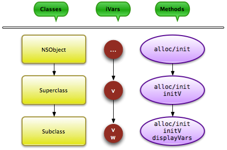

## Learn Objective-C, Objects (Part 4): Inheritance -- iVars & Methods

Inheritance is a central tenet of object-oriented programming. In a nutshell, it refers to the creation of new classes by extending, or subclassing existing classes, and in doing so, inheriting their features.

In Fraction‘s interface file, we have the following line:

```objc
@interface Fraction : NSObject
```

The part in bold indicates that `Fraction` is a *subclass* of `NSObject`, a class that Apple provides. Nearly every class you will create or interact with will have inherited from `NSObject`, directly or indirectly.

### Terminology

A *root class* is at the top of the inheritance hierarchy. Almost all Cocoa Touch and Foundation classes inherit from `NSObject`. Incidentally, `NSObject` is also an abstract class, so called because it’s not designed to be actually used—rarely will you ever use an NSObject; you’ll usually create and use subclasses. An abstract class therefore is one that is created for the purposes of subclassing.

A class that inherits from another is known as a "child" or "subclass" of its superclass.

### What Does This Mean?

Every subclass inherits certain properties of its superclass; exactly what is inherited can be controlled. By default, every class has access to all the instance variables of its superclass, and they work exactly as if you had defined those ivars in the subclass itself. In addition, a subclass will inherit any public methods that its superclass defines. As an example (kept in one file for brevity):

```objc
@interface Superclass : NSObject {
    int v;
}

- (void)initV;
@end

@implementation Superclass
- (void)initV {
    v = 20;
}
@end

@interface Subclass : Superclass {
    int w;
}

- (void)displayVars;
@end

@implementation Subclass
- (void)initW {
    w = 50;
}

- (void)displayVars {
    NSLog(@"v is %d, w is %d", v, w);
}
@end

int main(int argc, char *argv[]) {
    NSAutoreleasePool *pool = [[NSAutoreleasePool alloc] init];

    Subclass *sub = [[Subclass alloc] init];

    [sub initV];        // Inherited method & ivar
    [sub initW];        // Own method & ivar
    [sub displayVars];  // Inherited method [sub release];
    [pool drain];
    return 0;
}
```

Output:

```
v is 20, w is 50
```



*The inheritance chain.*

As you can see, we created an instance of an object of type Subclass. We then used it as any other class. Notice, however, that we called initV on the Subclass, and accessed the v ivar, neither of which were declared in Subclass. This is because these were already present in Superclass, and Subclass inherited them. The output proves that Subclass was able to access the inherited variables.

### Which Method?

[Remember](61.md) that a method is simply a declaration of what a class can do; when it is invoked at runtime, it is chosen out of that “list.” How does the program figure out which method to call (especially if you have more than one method of the same name in the inheritance chain)? In fact, the procedure is very simple. The runtime environment searches for an explicit declaration of that method in the class of the object that you sent the message to (in the above example, the search for displayVars begins with the Subclass class. If it is found in that class, it invokes that method (in other words, it invokes the version closest to that class in the inheritance chain). If it isn’t found, it looks for the method in the superclass; if it’s found, it invokes that version; if not, the search continues, until either the method is found, or it isn’t. In the latter case, you get a compiler warning, that the class may not respond to the specific method. When your code tries to call this method during execution, your program will likely crash.

---

[Previous Lesson](62.md) | [Next Lesson](65.md)
