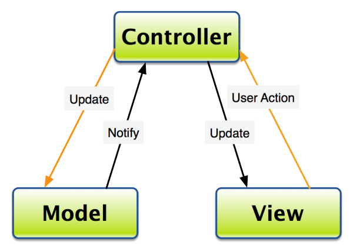

## Learn Objective-C, Design Patterns: Model-View-Controller

As programs get larger, there is a greater need for a paradigm to keep everything in order. At the simplest level, any program is a means to store data and present it in a meaningful way. With only a few views and a good data store, this might be rather easy in a simple app for iPhone. But with Pages-caliber apps, especially on the iPad, a formal solution is needed. Cocoa adopts the Model-View-Controller paradigm (MVC) to better organize projects.

### What is MVC?

Under the MVC system, your classes are one of three types- a model, a view, or a controller. Models store data in an organized form. For a simple app, the model could just be the actual data store, either in-memory (maybe as an `NSArray` or `NSDictionary`), or to-and-from disk. In a more complex app, you may choose to use a SQLite database or Core Data, and your model would be a simple instance or one piece of data. More importantly to MVC though, your model must not describe how to store the data—it must not contain any information about padding in the UI, for example, or the position (frame) of any item. Models are usually specific to your application, so they usually are not reusable, unless you have a "template" method to store data.

Views are what you actually see on-screen. They have functions to draw to screen or to other contexts. The view should not store the data it is displaying though—a label should not keep its text around; a table view should not store a copy of its data. Instead, along with MVC there are the patterns of delegation and the language features of KVC and KVO. Many of the classes from UIKit, including `UILabel`, `UITableView`, `UITextView`, and indeed `UIView` are views. Obviously, views, because they just display (any) data, can be very easily reused. Conversely, views of should not be bound to specific data. Some views may be suited to certain types of data—table views are more suited to text; the iPhone’s home screen is more suited for icons and short text—but you should not impose other restrictions, such as a maximum text length or that the text should only be of one case (that’s so 1980s…).

The view and the model should never interact. This preserves reusability. If `UITableView` had an outlet to your MainDataModel, it could it only be used with MainDataModel. If you had a model class called `Person`, it wouldn’t work with `UITableView` (and the Address Book app would never exist). The controller serves as a median. As shown in the image above, the controller controls interaction. If the model changes, the controller is notified and the view is changed accordingly (for example, you could call [tableView reloadData]). If user interaction changes the model (for example, deleting a row from a table view), the controller is also notified, and from there the change gets propagated to the data store. Therefore, the view can just tell the controller that some data at this location got deleted; the view does not have to worry about what to do or how to handle the deletion so it actually gets deleted. This goes back to the concept of abstraction, one of the fundamentals of object-oriented programming. Similarly, the model does not have to be concerned with exactly how the data got deleted, and just delete the data. In this way, the classes are kept clean and perform one function—the point of a class in the first place. Because the controller is the median and has to deal with specific views and data models, it is typically the least reusable. `UIViewController` implements so little functionality (from a functionality perspective- it actually does a lot behind the scenes) because controllers are very specific to each application. Most of your app logic goes into the controller.

Another compelling reason to use a controller is to make decisions. Obvious, but there are situations where changes to the model or view should not or need not propagate to the other. Without a controller, a change in the data at row 586 would affect the view even if the view was only showing rows 5–10, an unnecessary operation (which may even cause the UI to slow down for a moment). Other times, data should not be deleted, or deleted at a later time—if a file is being written to from another thread, a delete command from the UI should not be executed immediately. The write should be stopped or allowed to finish before the delete occurs.

### Mediation

Hand-in-hand with MVC comes the concept of delegation (and data sources). Data sources are obvious—protocols such as `UITableViewDataSource` make it so a table view can get data from an id type, making the table view very reusable. The controller implements the delegate, and asks its data model for data as necessary (or as the data source methods are called). More interestingly though, the controller can return data that does not correspond to the data model; in fact, the controller could calculate values and not have a data model at all. The table view does not have to know about this though, and does not need to do any extra handling in these cases.

The data source protocol “pushes” data to the view; the delegate goes in the other direction and informs the controller of changes to the view. There is a naming convention involved, which will be the topic of a future post. Again, the controller can notify the model, or not, depending on the situation.

[KVC](79.md) and [KVO](89.md) are not really used in simple applications. However, with multiple controllers that need to interact with each other, KVC and KVO can be used to great benefit. KVO, which stands for Key-Value Observing, registers a class for notifications when a key-value is changed in any other class. This is a more advanced topic, and will form the basis of another post. It is an effective way to allow multiple controllers to communicate without resorting to a tangle of protocols.

*This post is part of the [Learn Objective-C in 24 Days](38.md) course.*

---

[Previous Lesson](86.md) | [Next Lesson](88.md)
