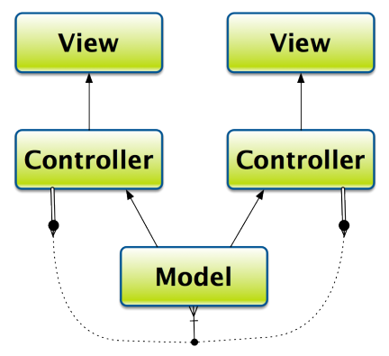

## Learn Objective-C, Design Patterns: Key-Value Observing

Key-Value Observing (KVO) is heavily used in OS X development in bindings and form a significant portion of UI design. However, with iOS, it takes on somewhat less significance and is mostly used as necessary to simplify program design. KVO “broadcasts” a notification whenever a property is modified, and any class can receive those notifications and handle changes as necessary. This helps to decouple your classes from each other, allowing more flexible and re-usable code, especially as your code grows large and you have many sets of MVC objects.



It is primarily used when you have one model object backing multiple controllers, in which case you can use KVO to update the model when any controller changes its data.

### Preparing for Key-Value Observing

KVO is set up for you when you use properties. Whenever you use dot-notation or the setter methods to change a property, the corresponding KVO method is called and all receivers will be notified. If you do not use properties or write your own setters, you may want to manually call change notification methods; see the section below to do so.

### Key-Value Observing Compliance

To be KVO-compliant, your class must first be [KVC compliant](79.md). This means that you should have proper, working implementations for `valueForKey:` and `setValue:forKey:`. In addition, you should emit the proper notifications when changes are made.

As stated above, if you use standard setters, the notifications are called for you, and you don’t have to worry about them.

### Manually Call Change Notifications

You may need to manually call notifications if you don’t use standard setters, if you want to minimize notifications for certain situations, or to package multiple changes into a single notification.

First, you have to override the implementation of `automaticallyNotifiesObserversForKey:`, which is a class method declared in the `NSKeyValueObserving` protocol. Given a key, if you want manual notification, return NO; otherwise, return `YES`. If the key is not recognized, call the super implementation. The default implementation in `NSObject` simply returns `YES`.

```objc
+ (BOOL)automaticallyNotifiesObserversForKey:(NSString *)theKey {
    if ([theKey isEqualToString:@"openingBalance"]) return NO; 
    else return [super automaticallyNotifiesObserversForKey:theKey];
}
```

Then, to call the actual notifications, you call `willChangeValueForKey:` before changing the value, and `didChangeValueForKey:` after the change.

```objc
- (void)setBalance:(double)newBalance { 
    // Should not compare double directly, 
    // But means the same as if (balance == newBalance) 
    if (fabs(balance - newBalance) < 0.0001) return; 
    [self willChangeValueForKey:@"balance"]; 
    balance = newBalance; 
    [self didChangeValueForKey:@"balance"];
}
```

Note that to minimize redundant notifications, you can check to see if the value has actually changed.

Finally, you can call `willChangeValueForKey:` and `didChangeValueForKey:` multiple times with different keys to send multiple notifications if multiple values get changed.

### Registering for Key-Value Observing

To register a class for Key-Value Observing, the observed class must be KVO-compliant for the properties that you want to observe (obviously), you must register as an observer, and implement the observing method.

Note that not all classes are KVO-compliant for all properties. Ensure compatibility as necessary in your classes, but note that properties in Apple’s code are only KVO-compliant of the documentation says so.

### Register an Observer

The observed object must be made aware of the observer by sending the `addObserver:forKeyPath:options:context:` method. In your view controller, you might have the following method, which registers a model object as an observer for the balance property:

```objc
- (void)registerObserver {
    [modelObject addObserver:self forKeyPath:@"balance" options:(NSKeyValueObservingOptionNew | NSKeyValueObservingOptionOld) context:NULL];
}
```

The options argument takes one or more of the [NSKeyValueObservingOptions](https://developer.apple.com/documentation/foundation/notifications/nskeyvalueobserving?language=objc) values. You will most often use the constants in the example above, which tells the system to return both the original and new values. You specify both using the bitwise OR operator (`|`), the vertical bar.

The context is a pointer to anything you wish, and is provided as-is to the observer. You can use it as an identifier to determine the change, or to provide any other data. It is your responsibility to retain and/or release it as necessary; it is not retained by the system. The context can be used to identify your notifications. [A problem may arise because you can register the same keyPath on multiple objects](https://www.dribin.org/dave/blog/archives/2008/09/24/proper_kvo_usage/). You can therefore use a distinguishing context to determine the calling class. See [this link](https://www.dribin.org/dave/blog/archives/2008/09/24/proper_kvo_usage/) for more information on how to solve this issue.

### Receiving Notifications

All observers must implement the `observeValueForKeyPath:ofObject:change:context:` method. The observer is provided the original object and key path that triggered the change, a dictionary containing the details of the actual change, and the user-specified context described above.

The dictionary has a value accessed through the `NSKeyValueChangeKindKey`, which is a standard `NSDictionary` change key. It provides information about the change, returning an [NSKeyValueChangeSetting](https://developer.apple.com/documentation/foundation/notifications/nskeyvalueobserving?language=objc). The exact values are defined in the link. You can also access the old or new values (depending on whether neither, one, or both were requested) through the `NSKeyValueChangeOldKey` and `NSKeyValueChangeNewKey` keys. If the property is an object, it is returned directly; scalars or C structs are wrapped as an [NSValue](https://developer.apple.com/documentation/foundation/nsvalue?language=objc) object.

```objc
- (void)observeValueForKeyPath:(NSString *)keyPath ofObject:(id)object change:(NSDictionary *)change context:(void *)context {
    if ([keyPath isEqual:@"balance"]) { 
        // Handle change 
    } else { // Unrecognized keypath 
        [super observeValueForKeyPath:keyPath];
    }
```

### Removing an Observer

To clean up after yourself, you should remove yourself as an observer by calling the `removeObserver:forKeyPath:` method.

```objc
- (void)unregisterForKVO {
    [modelObject removeObserver:self forKeyPath:@"balance"];
}
```

If you received a context from the notifications, you should only release it after removing the observer.

*This post is part of the [Learn Objective-C in 24 Days](38.md) course.*

---

[Previous Lesson](88.md) | [Next Lesson](95.md)
