## Learn Objective-C, Building an App (Part 1): Basic UI Elements 

Recently, we've been discussing concepts. This week, we're going to take a break from that and start working on an app that will cover many of the high-level topics in the iOS SDK and allow you to build many interfaces with Interface Builder. We'll start from a bare-bones project template and work our way up from there. 

I'm running Xcode 4.1 on Mac OS X 10.7 Lion. Xcode 4 is available on the Mac App Store for both Snow Leopard and Lion. You can use Xcode 3, but some things (especially Interface Builder) will be different, so you may have to "translate" some of the screenshots. Nevertheless, the procedure in Xcode 3 is still similar, just in different places. Xcode 4 is the future, and despite the criticisms, does have some really nice features. And it includes the latest features, many of which make coding much easier. So fire up Xcode, and let's get started. 

### Setting Up the Project 

When you first start Xcode 4, you'll be presented with the Welcome to Xcode window. As you create more projects, the list to the right will get populated with those projects. For now, read the texts if you wish, but click on "Create a new Xcode project" to get started. 


*Xcode 9.2 Welcome Window*

A new window will appear, and a modal sheet will slide down. From the left column, under iOS, select "Application". Then, in the top-right pane select "Window-Based Application" (it may be called "Empty Application"). Click Next. 

For **Product Name:** , call it "SDK Demo". You can call it something else, but you'll have to make adjustments down the road. You can ignore the other options; we'll talk about them in later posts. Click Next and find a place to save your project. 

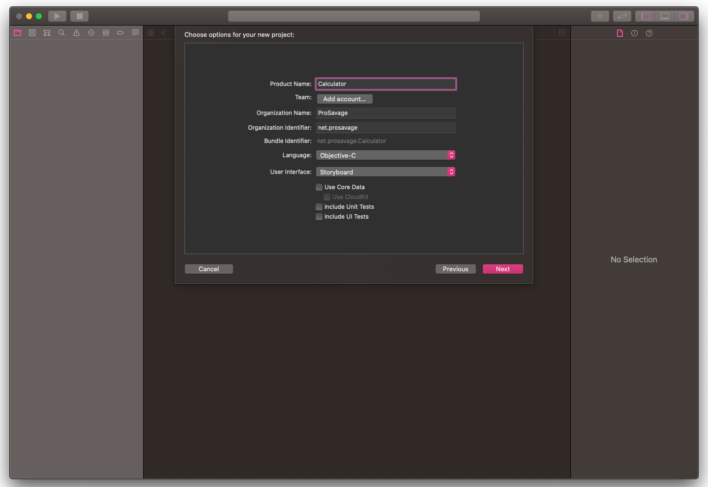


*Xcode Main Project Window*

Xcode should now present the main project window, and your project has been set up. At this point you can click on the circular Run button in the top-left of the main Xcode window, which will launch your app in the iPhone Simulator. 

All you'll see at the moment is a blank white screen—that's because we haven't done anything yet. Let's do that now. 

### The Root View Controller 

All iOS applications should have a root view controller. There are books and tutorials online that tell you to do your whole interface in the app delegate (I'll talk about this below)—which you can, but it is not recommended for anything but the simplest project. Sometime in the future, applications will be expected to have a root view controller—they will no longer be optional. It's just a good idea. So let's create one. 

In Xcode, go to File > New > New File… (Command-N). On the left, select Cocoa Touch under iOS and select the second option, UIViewController subclass. Click Next. For Class, call it RootViewController. Make sure it's a subclass of UIViewController, and that it comes with a XIB for the user interface. Click Next, and accept the default save location. Click Create. 

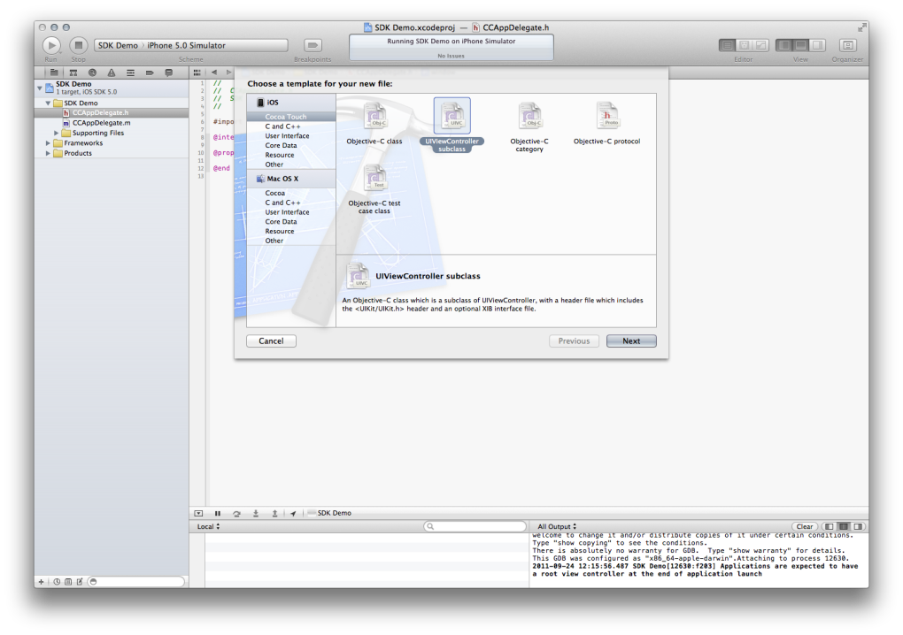

*New File Picker*

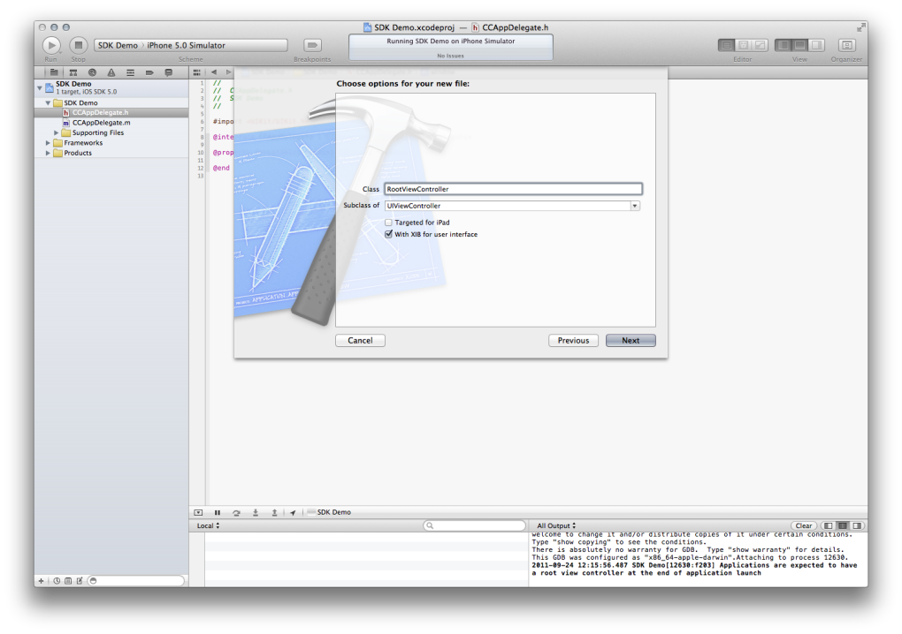

*Name new file*

In the File Navigator, click on AppDelegate.h. There is some existing code provided by the template; leave that there. Note that the provided code may differ across versions of Xcode, but the general meaning and end results are the same. Add the following lines to the existing code to set up the header file. 

```objc
#import <UIKit/UIKit.h> 
@class RootViewController;    // Add this line
@interface AppDelegate : UIResponder <UIApplicationDelegate>

@property (nonatomic, retain) UIWindow *window;
@property (nonatomic, retain) RootViewController *rootViewController;    // Add this line too 
@end
```

Switch to the .m file, either by selecting the file in the File Navigator, or pressing Command-Control-↑. In this case, there's a lot of comments and sample code that we aren't going to use now. You can keep it if you wish, or replace the file with this code: 
    
```objc
#import "AppDelegate.h"
#import "RootViewController.h"

@implementation AppDelegate

@synthesize window = _window;
@synthesize rootViewController = _rootViewController;

- (void)dealloc {
    [_window release];
    [_rootViewController release];
    [super dealloc];
}

- (BOOL)application:(UIApplication *)application didFinishLaunchingWithOptions:(NSDictionary *)launchOptions {
    // Override point for customization after application launch.
    self.window.backgroundColor = [UIColor whiteColor];
    _rootViewController = [[RootViewController alloc] init];
    self.window.rootViewController = self.rootViewController;
    [self.window makeKeyAndVisible];
    return YES;
}

@end
```

The code of interest is in the `application:DidFinishLaunchingWithOptions:` method. Every app starts off as a window, and that's what the first line does—it creates a window that is the size of the screen, and autoreleases it. That line, and the next, which sets the window's background color to white, is provided by the template. The next two lines are what's important here- you're initializing the RootViewController instance, and assigning it to the window's rootViewController property, which was new in iOS 4.0. In iOS 3.x and earlier, you couldn't directly set the view controller; you had to set the view instead. 
    
```objc
[_window addSubview:self.rootViewController.view];
```

The last two lines actually display the window, and return YES. If you return NO, the app will then be quit. The app setup is now done. Running the app, you won't notice any visual difference, but the setup is indeed complete. 

### The App Delegate 

Now is a good place to take a detour and talk about the app delegate. This class, created with every project, is the interface between the iOS system and your app. When the system has finished loading the app, the application:didFinishLaunchingWithOptions: method is called. In many cases, you can ignore the arguments to the method. Generally, here you perform some basic setup, including creating the main window and the root view controller as you saw above. In a game, you may also choose to initialize timers or graphics engines here, but make sure you don't do something too time-intensive, or your app will appear to hang. 

Other situations in which app delegate methods may be called include times when your app is being quit, in which you have a few seconds to do some last-minute processing or to save state, or when your app goes into or comes from the background. "The background" is only present in a multi-tasking environment (iOS 4.0 or higher on some iOS devices), when your app may be dismissed without being quit. In those cases, you may want to save state, or pause game timers, or close network connections. 

Do note that in all these cases, you have limited time to do your processing, so you shouldn't be calculating pi to 15 million digits here. Taking too long to do any processing will make your app appear to hang, and the system will try to avoid that. 

A technical note: how does the system know which class the app delegate is? If you want to know, open up the Supporting Files group in the File Navigator. Select the main.m file. Inside, you'll find this code: 
    
```objc
UIApplicationMain(argc, argv, nil, NSStringFromClass([AppDelegate class]))
```

That fourth argument to the `UIApplicationMain()` function is the name of the app delegate class, passed in as an `NSString`. `NSStringFromClass()` takes a Class object (found by invoking the class method on any class) and returns the string with its name. That's how the system finds the app delegate. 

### Creating the Root View Controller 

In this initial revision of our app, we'll add in some basic functionality that shows off some basic UIKit elements. We will also be exploring Xcode 4′s new Interface Builder, included within Xcode's main window. 

Open up RootViewController.h and put in the following code. 
    
```objc
#import <UIKit/UIKit.h>
@interface RootViewController : UIViewController {
    int buttonPressCount;
}

@property (nonatomic, retain) IBOutlet UILabel *buttonPressLabel;
@property (nonatomic, retain) IBOutlet UILabel *echoLabel;

- (IBAction)simpleButtonPressed:(id)sender;
- (IBAction)textFieldTextDidChange:(id)sender;
@end
```

You add two label outlets and two action methods. The IBOutlet and IBAction qualifiers don't affect your code at all, but they are a "hint" to Interface Builder as connect points. 

Interestingly, the action methods take one argument, of a generic type. This sender object is the object that triggered the event. You could have written the method without the argument, but then you would not know which object triggered the method. In some cases, you can determine what course of action you want to take based on the sender object (you can hook up one action method to multiple objects), or access some property of the sender. We will use the second reason. By doing so, we can avoid declaring two additional outlets, only to access their properties. As you gain more experience, you'll get a feel for which properties you need to declare and hook up, and which you can obtain from method arguments, cleaning up your code. 

 Setting Up the Interface 

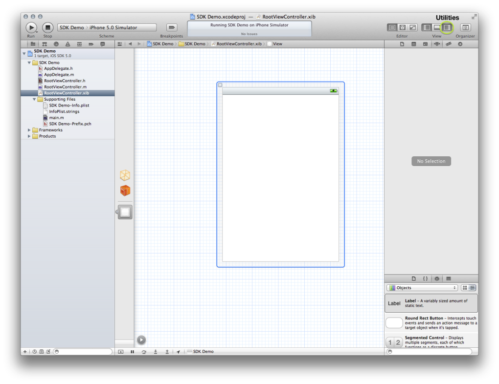

*Blank window with Utilities*

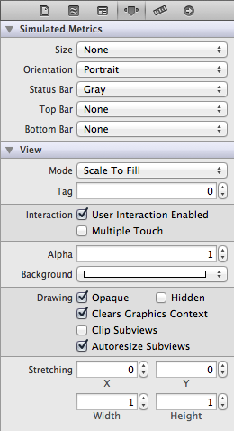

*UIView Attributes*

With your declarations done, switch over to RootViewController.xib. Open up the Utilities pane by clicking on the third button in the View group in the toolbar, or by pressing Command-Option-4. Click in the main view to select it and bring up the Attributes. 

The white background is a bit garish, so click on the double arrows at the right end of the Background popup. If you click in the middle, you'll get the standard color picker. If you click on the double arrows, you get a list of recent colors, and some options that you can't get in the color picker. 

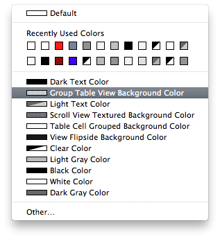

*Color Choices*

Select the "Group Table View Background Color". The main view will take on a blue-and-white pinstripe appearance. That's better. 

The bottom part of the Utilities pane has four small icons. Select the third one to bring up a list of UI elements you can use. The search bar at the bottom allows you to filter the results. Drag out a button into the main view. 

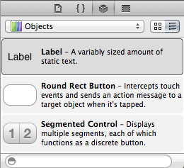

*UI Elements Library*

As you drag, you'll see blue guidelines appear- those are Apple's recommendations for spacing, keeping your UI elements away from the edges of the screen, where they may be hard to hit, and away from each other, to prevent the wrong element from being touched. A guideline will appear at the middle of the screen. Align the button with the top guideline and down the middle. 

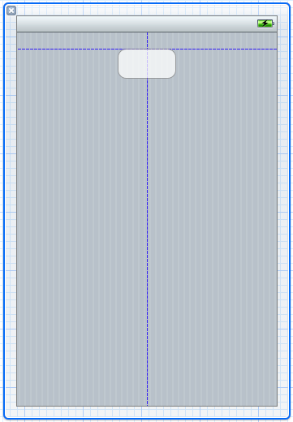

*Blue Guidelines*

Using the horizontal drag handles, make the button about 160 pixels wide (there will be an overlay telling you the size; don't worry about the exact value), and bring it back to the center using the guides. Double click in the center of the button to bring up a text-editing field. Type in "Press Me!" or something similar. Click off the main view to deselect the button. 

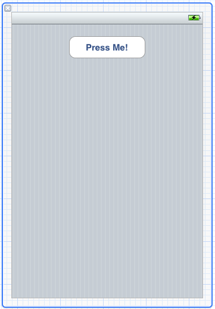

*Finalized Button*

Drag out a label and center it. Move it up toward the button until the guide appears underneath the button, and leave it there. Again, make it 128 pixels wide and center it. Using the Attributes inspector, set the following properties: 

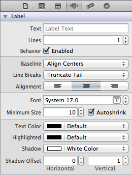

*Label Attributes*

* Set Alignment to centered 
* Make the Text Color Black (or Default) 
* Make the Shadow color White 
* Make the Shadow Offset 0 Horizontal, 1 Vertical (the default is -1) 
* Clear out the text, so that the label isn't displaying "Label" 

Drag out a text field. Make it 160 pixels wide, centered horizontally. The vertical position doesn't really matter too much. Keep the default attributes for now; feel free to play around with them later. Now hold down the Option key. Click and drag the original label to a position underneath the text field. You'll make a copy of the original label, including all the attributes. 

### Making Connections 

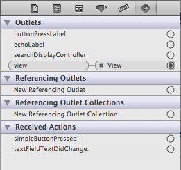

*Connections Inspector*

Now that we have the UI elements laid out, we're going to connect it to our outlets and actions. There are many ways to do that; for now, because our inspectors are open, we're going to use those. We'll cover other methods in future posts. Open the Connections inspector (the sixth option in the Utilities sidebar) or press Command-Option-6. Select the first object along the bar to the left—it looks like a light orange cube and when you mouse over it, the pop-up says "File's Owner." This is a proxy object (I'll talk about that in a future post when we explore Xcode) that references the owner of the XIB—in this case, RootViewController.h. Selecting that, some outlets show up in the connections inspector. First we'll wire up the outlets. 

Click in the little circle to the right of the buttonPressLabelentry. Drag the cursor over to the label below the button, and let go. As you drag, you'll see a blue line appear, starting from that little circle. 

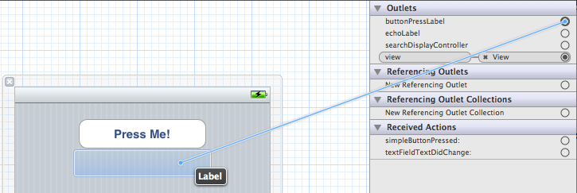

*Blue line shows connection.*

The connection will show up in the connection inspector. Repeat the process for the echoLabel, connecting it to the label beneath the text field. 

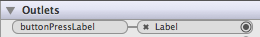

*Visual Connection*

Under the Received Actions section, drag from simpleButtonProssed: to the button in your interface. This time, you're connecting an action; when you release, you'll get a list of eventsthat the button can respond to. You can have different methods trigger based on what type of touch input the button receives. 

 <!-- image not on website -->

*UIControl Events List*

Select "Touch Up Inside", which means that the action will only be triggered if a finger touches down and up—what you would naturally do—all within the borders of the button. This is the most commonly-used choice for buttons. Connect textFieldTextDidChange: to the text field, but this time select Editing Changed for the event. This will have the method be called every time the text inside the text field changes—it'll get called every time the user types a letter or hits the backspace. 

Having wired up the entire interface, return to the code—open RootViewController.m. 

### Coding the Actions 

You can replace the existing code with the following: 
    
```objc
#import "RootViewController.h"

@implementation RootViewController
@synthesize buttonPressLabel = _buttonPressLabel;
@synthesize echoLabel = _echoLabel;

#pragma mark - Memory Management
- (void)dealloc {
    [_buttonPressLabel release];
    [_echoLabel release];
}

#pragma mark - View lifecycle
- (void)viewDidLoad {
    buttonPressCount = 0;
}

- (void)viewDidUnload {
    [super viewDidUnload];
    // Release any retained subviews of the main view to relieve memory usage
    self.buttonPressLabel = nil;
    self.echoLabel = nil;
}

#pragma mark - Action Methods
- (IBAction)simpleButtonPressed:(id)sender {
    buttonPressCount  ;
    NSString *pluralHandlerString = (buttonPressCount == 1) ? @"time" : @"times";
    NSString *displayString = [[NSString alloc] initWithFormat:@"Button pressed %d %@", buttonPressCount, pluralHandlerString];
    self.buttonPressLabel.text = displayString;
    [displayString release];
}

- (IBAction)textFieldTextDidChange:(id)sender {
    UITextField *textField = (UITextField *)sender;
    NSString *textFieldText = textField.text;
    self.echoLabel.text = textFieldText;
}
@end
```

The beginning isn't of much interest—we're importing files, synthesizing properties, and dealing with memory management. The viewDidLoad method is where you usually do some setup—initialize instance variables, or set some properties on UI elements. viewDidUnload is where you release your retained subviews (and any other properties that you initialize or create in viewDidLoad) to free up that memory, when your view disappears. The action methods warrant some discussion. 

The first action method simply keeps track of the number of times the button is pressed and displays that. It uses the buttonPressCount instance variable, incrementing it each time the button is pressed. There is initially a string that uses [the conditional operator](50.md) to determine whether or not to use the plural form of "time." Then that string is plugged into the final string, along with the run count, to form the displayString. This is then assigned to the text property of the corresponding label, which causes the text to be displayed. The string is released according to memory management rules. 

The second action method uses the sender argument, first casting it to a UITextField. It grabs the current text value from the text field—this method is called every time the text changes, so the text value will be different every time, and then this text is assigned to the label's text property as before. The text field manages its text property, so you don't have to release it. 

### The Finished Product 

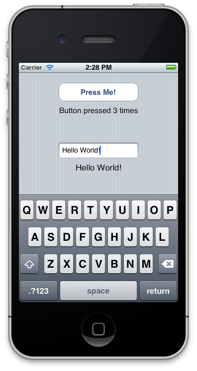

At this point, the first version of our demo app is done. Hit Run in the toolbar, and it should bring up the iPhone Simulator. Play around with the button presses and the text field. If you have build issues or warnings, post them in the comments or email me, and I'll get back to you as soon as possible. 

### One More Thing 

Once the keyboard shows up, you can't get rid of it without quitting the app. Let's fix that. 

Add an action method called dismissKeyboard: to the header, which takes one sender. The sender will be the text field. Connect the method in IB to the text field's Did End on Exit event. The implementation of the method should be like this: 

```objc
- (IBAction)dismissKeyboard:(id)sender { 
    [(UITextField *)sender resignFirstResponder];
}
```

Now, if you hit the Return key on the keypad, the keyboard will slide away. The important part is the resignFirstResponder method call, which in the case of a text field will also dismiss the keyboard. 

And that's all there is to it. 

### Project Download 

You can download the source for this project [here](../code_resources/Building%20an%20App%20Part%201%20-%20Basic%20UI%20Elements).

*This post is part of the [Learn Objective-C in 24 Days](38.md) course.*

---

[Previous Lesson](89.md) | [Next Lesson](91.md)
