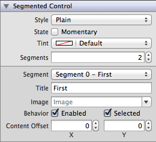
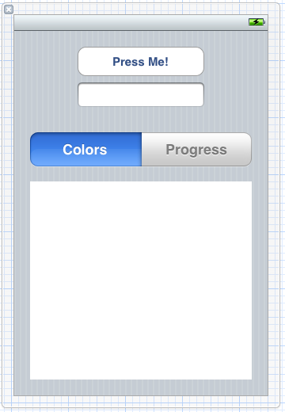
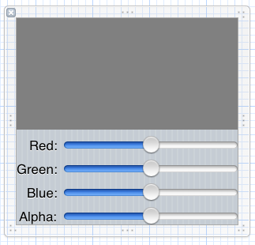
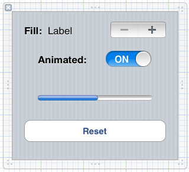
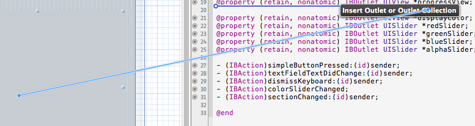
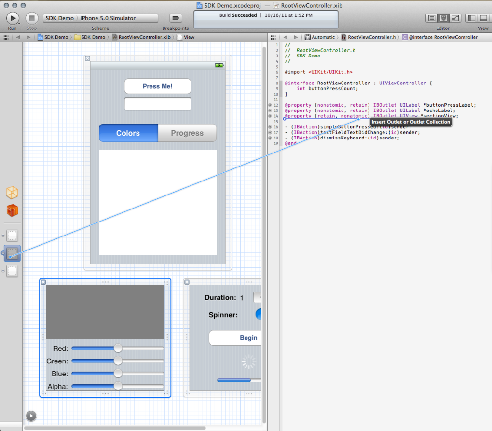
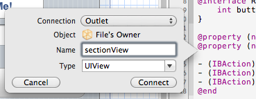
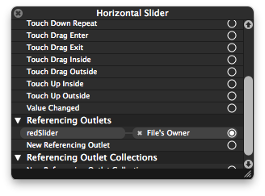
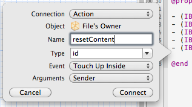

##  Learn Objective-C, Building an App (Part 2): More UI Elements 

This week we're going to continue from [Part 1](90.md) and explore additional UI elements. Before we begin though, a bit of (old) news—iOS 5.0 was released on Wednesday, and with it Xcode 4.2. As such, from now on I will be working with Xcode 4.2 and the 5.0 SDK. Once we get the basics down we can discuss compatibility with older versions and how to check the system version, but we'll use the newest and greatest for now. 

The Xcode 4.2 build is 4D199 (you'd be surprised how difficult it was to find that anywhere else—important if you're upgrading from a Developer Preview), which you can get either from the Welcome screen or by going to Xcode > About Xcode. There is an installation issue floating around in which you may be constantly installing 4.1. In that case, I'd recommend uninstalling Xcode first, and then running the "Install Xcode.app" that the App Store downloads. That fixed the problem for me. 

Once Xcode is installed, open up the project from last time, and dive into RootViewController.xib. 

### Interface First 

With Xcode 4′s integration of Interface Builder and the code, it breaks down the boundaries of code versus interface and allows you to easily jump back and forth as ideas come into your head. This time, we'll put together the interface first and then hook it up to code—even to code that doesn't exist yet. 

First, start by moving the text field up a bit so we have some more vertical room below. Drag it up, following the blue guidelines, until it snaps into place a bit below the button. 



*Segmented Control Properties*

Drag out a Segmented Control and place it near the middle of the screen. Extend the width until you get to the blue guidelines at the left and right of the screen. Go to the Attributes Inspector, and use the Segment pop-up menu to select "Segment 0 – First". Underneath, change the Title to "Colors" and watch the change propagate to the UI as well. Change the title of the second segment to "Progress" using the pop-up to change the segment. 

The segmented control works similar to the tabs you see across OS X, especially in System Preferences—users expect them to "swap" view content to something else, and they are usually placed above the content that you expect to swap. For simpler views it may be easy enough to place views overlapping each other and hide or show them as necessary (UIView has a hidden property that can be set to YES or NO). However, this is quite cumbersome and doesn't scale very well. A better alternative is to create a plain UIView and set that to individual views as necessary. Therefore, drag out a basic UIView, align it underneath the segmented control, make it as wide, and drag it down until the blue guidelines appear at the bottom. It should look like this: 



*New Main View*

Now select the view, and copy (Command-C) it. Click outside of the main view (on the main canvas area) and paste (Command-V). You should get a blank view the size of the original, floating around on the canvas. Click on the canvas again, and paste another view. They will be the views you'll swap in with the segmented control. 

Set the background of both views to Group Table View Background Color. It may be easier to set their color to transparent, but this has a major impact on drawing performance—it is much faster to set a specific opaque color. 

Drag out UI elements from the Library to build two views like you see here. The exact positioning doesn't matter, but make sure to get the correct elements. The first view contains a standard UIView at the top with the Background color set to 50% gray (click on the left part of the Background control in the inspector to get the standard OS X color picker). Underneath are four labels, right-aligned with a standard shadow (most UI text in iOS is drawn with a shadow) and four sliders next to the labels. Here, don't worry about the edge guidelines—go right up to the edge of the view. You've already accounted for the edge guides in the main view. 



*Sliders View*

The second view contains a few more elements—a bold-font label, a regular-font label, a stepper control (new in iOS 5), another bold-font label, a switch, a progress view, and a button. None of the views except the labels have been customized away from their default appearance. The regular label should have its text set to 0%, rather than the standard "Label". 



*Progress View*

We have to set some properties on the stepper for it to work with us. Select it then open the Utilities Inspector. The Minimum value should stay at 0 but the Maximum should go up to 100. Increase the Step to 10 to have it change by 10, from 0 to to 100. Also, select the progress view and set the Progress to 0. 

### Making Connections 

Our interface design is now done, so let's make the connections. Open the Assistant editor (The second button in the "Editor" group in the toolbar). Make sure the file in the right pane is RootViewController.h (you can use the jump bar). Control-drag from the blank view in the main view to a blank line in your header. You'll get a gray rectangle that says "Insert Outlet or Outlet Collection". 



*New Connection*

Let go, and you get a little popup that lets you configure the outlet name and type. Call the outlet sectionView. Click Connect, and a new property will appear with a blue flash. To connect the other smaller views, you'll have to Control-drag from the icons on the left edge of the IB view to the code. See screenshot below: 



*Connection from Sidebar*

The view with the sliders should be called colorsView; the other should be called progressView. 



*New Outlet Popup*

Then, connect all five elements in the colorsView to the header as well—displayColor, redSlider, greenSlider, blueSlider, and alphaSlider. The progressView isn't quite as straight-forward, but it's not difficult. Connect the label next to "Fill:" as amountLabel, the stepper as amountStepper, the switch as animatedSwitch, and the progress view as progressIndicator. 

Now we'll connect the actions. Start off with one of the sliders—right click on one of them, and scroll down until you find the Value Changed Event. 



*Control Events*

Click and drag from the circle to the right until you come to a new line underneath the actions—you'll get a blue line you'll be familiar with now. You'll get the gray rectangle that says "Insert Action" this time. In the pop-up, call the method colorSliderChanged. Next to Arguments, select "None" from the menu. Click Connect. Now do the same with the other sliders, but rather than dragging to a new line, drag until the colorSliderChanged method becomes highlighted. You'll connect to that method, rather than creating a new one. We'll use a slightly different way to connect the button's action. Control-drag from the "Reset" button to a new line underneath the actions. The default option will connect an outlet, but we want an action. From the Connections popup menu, choose Action instead. Change the name to resetContent. 



*New Action Popup*

Note that the event is "Touch Up Inside", the default for buttons. Arguments should again be None. Connect the stepper control in the same way. Name should be fillAmountChanged; Arguments should be None. Note the default event, "Value Changed" for the segmented control. Arguments should be None. 

Finally, we'll have to connect the segmented control as well. Follow the same process as before. The name should be sectionChanged. Arguments should be Sender. 

### Writing the Code 

Open RootViewController.m and scroll through the file. You'll note a bunch of synthesized properties, ivars added to the dealloc method, and blank methods for all the actions you just connected. This saves us a lot of boilerplate code and lets us get right down to work. Put in a blank line in the colorSliderChanged method after the opening brace. This method will change the fill color of that gray rectangle based on the slider values, converting to an RGB-A color. Note though that this isn't necessarily a recommended way to do it- it can be slow on older devices. 

We'll create four float variables to hold the values of the sliders, then create a UIColor instance based off the floats. Then we assign that as the background color of the blank view. The code for the method: 
    
```objc
- (IBAction)colorSliderChanged {
    float redColor = self.redSlider.value;
    float greenColor = self.greenSlider.value;
    float blueColor = self.blueSlider.value;
    float alphaValue = self.alphaSlider.value;
    UIColor *newBackground = [UIColor colorWithRed:redColor green:greenColor blue:blueColor alpha:alphaValue];
    self.displayColor.backgroundColor = newBackground;
}
```

Next, let's handle the case where the stepper's value is changed. First we need to update the label, which we've already connected. We grab the stepper's value, and create a string out of that. Then we assign the string to the label's text property. Next, we'll update the progress bar. We use the switch's on property to determine if we should animate, and use the stepper's value to determine where to fill to. 
    
```objc
- (IBAction)fillAmountChanged {
    NSInteger amount = (NSInteger)self.amountStepper.value;
    // You need two percents to "escape" it and actually display a percent sign
    NSString *amountString = [NSString stringWithFormat:@"%d%%", amount];
    self.amountLabel.text = amountString;
    [self.progressIndicator setProgress:((float)amount / 100.0) animated:self.animatedSwitch.on];
}
```

The reset method is easy. We're just assigning some properties. 
    
```objc
- (IBAction)resetContent:(id)sender {
    self.amountStepper.value = 0.0;
    self.amountLabel.text = @"0%";
    [self.animatedSwitch setOn:YES animated:YES];
    [self.progressIndicator setProgress:0.0 animated:YES];
}
```

There's one last bit that we have to handle—view swapping. Right now if you run the project you'll just get a white rectangle on screen and you'll not get any of our new code. A simple method like this will fix the issue: 
    
```objc
- (IBAction)sectionChanged:(id)sender {
    UISegmentedControl *sectionControl = (UISegmentedControl *)sender;
    if (sectionControl.selectedSegmentIndex == 0)       // Colors section
        [self.sectionView addSubview:self.colorsView];
    else if (sectionControl.selectedSegmentIndex == 1)  // Progress section
        [self.sectionView addSubview:self.progressView];
}
```

In this method, we're simply adding the correct view to our main placeholder view as necessary. 

Now the code is complete. But if you run it, you'll see an obvious problem—the first time you run, you'll get a blank white rectangle. It's only when you select a segment in the segmented control that you get a view. Let's fix that by adding this one line to `viewDidLoad:` 

```objc
[self.sectionView addSubview:self.colorsView];
```

We know that the first view to load will be the colors view, so automatically we'll add that view. If you build and run now, you'll get the fully working app. 

*This post is part of the [Learn Objective-C in 24 Days](38.md) course.*

---

[Previous Lesson](90.md) | [Next Lesson](92.md)
