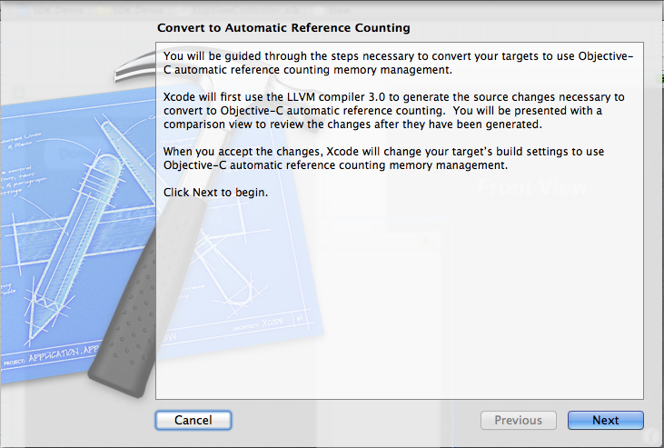
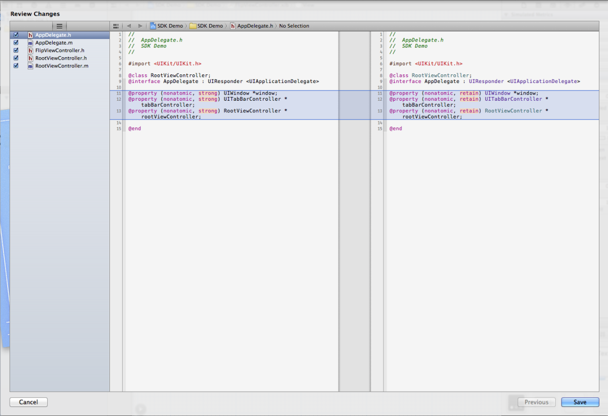
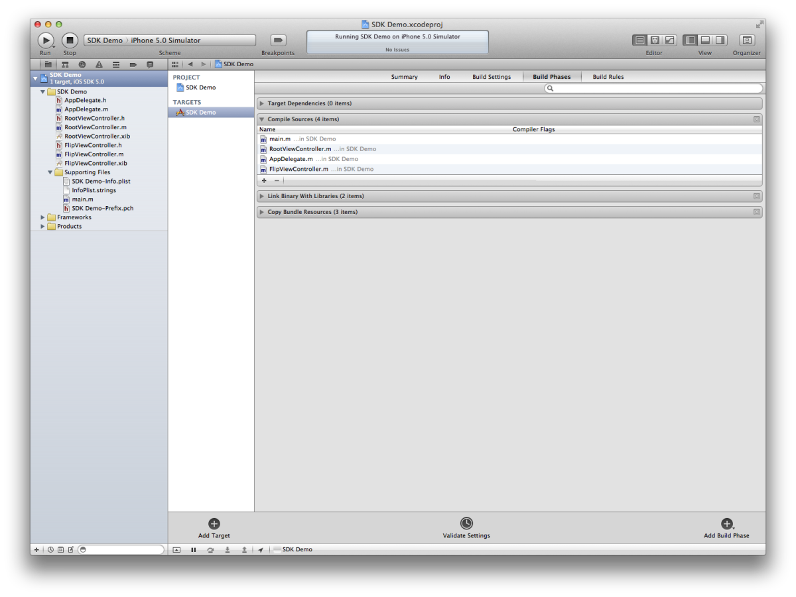

## Learn Objective-C, Building an App (Part 4): Automatic Reference Counting

So far, we have been manually doing our memory management according to the [basic rules](75.md) established a long time ago. This method is still fine and is still the standard way to do it, but at WWDC 2011 Apple unveiled the revolutionary ARC technology. ARC stands for **Automatic Reference Counting** which does exactly what it sounds like—it automates the reference counting steps for you. It follows the exact same rules as the old memory management implementations, just automated for you. Rather than doing a runtime cleanup, as [garbage collection](https://en.wikipedia.org/wiki/Garbage_collection_(computer_science)) does (a process which slows the running of your program at random intervals), the compiler looks at your code and automatically inserts retain, release, and autorelease calls as necessary. In this way, the performance of your application isn’t impacted in the least but it could save you a lot of work- after all, computers were designed to do menial labor like that.

In this post we'll convert our existing project to ARC. Once we're there, little work remains in memory management. Basically, ARC frees us from thinking about memory management at all, so upon finishing the conversion process we won't be dealing with memory management anymore. Let's get started. 

### Converting to ARC 

Open our project and go to Edit > Refactor > Convert to Objective-C ARC…. You'll get a sheet that says "Select Targets to Convert"; select the only option the list which should be called "SDK Demo.app (SDK Demo)". Then click Precheck. Xcode will build your project then present a new sheet with an introduction. 



*ARC Conversion Intro Screen*

Click Next and it'll say "Generating Preview" for a few moments. The sheet will then expand, providing you with a two column view of your code. 



*Revisions Editor*

To the very left you'll see a list of files. In the main content, the left pane is the new code; the right pane is what you currently have. Changed lines are shaded in blue with a darker blue outline; changed code is highlighted in a salmon-esque color (by default). You can go through the list of files on the left (there should be five) and see the changes that ARC will do for you. You'll notice that in the properties, retain is replaced by the new keyword strong; in the implementation files dealloc methods are stripped away, as are retain, release, and autorelease calls. The latter methods are now obsolete and you can't actually call them anymore. Dealloc is not subject to the same treatment, but unless you're doing some custom cleanup that goes beyond freeing memory, you shouldn't have your own dealloc. Review the changes, and click Save in the lower-right. 

Now Build & Run the app and when it comes in the Simulator you'll notice that everything works just as before. …And, that's it! Converting an app to ARC is just that easy. Note though, that in some cases the compiler may encounter cases where it can't directly convert your code, in which case it'll issue an error which you will have to address before you can run your app. This is often the case with files you might receive as part of someone else's code library. In those cases, it is usually best to allow the original developer to support ARC or not as necessary. For the time being though, you can turn off ARC on a per-file basis to suppress those errors and run the code with the existing memory management code. 

### Selectively Turning Off ARC 

To do so, select the Top Level project in the File Navigator, and select the name of your Target in the pane immediately to the right. Then in the main content pane, select Build Phases from the top, and expand the disclosure triangle next to "Compile Sources". 



*Disable ARC per file here.*

Select one or more files that you wish to exclude from ARC, and then hit Return on the keyboard. A little text field will appear. Inside that field, type 
    
```objc
-fno-objc-arc
```

Which is a compiler flag to turn off ARC for those files. Hit Done and you'll see the flag appear next to the files you've selected. 

### Compatibility 

ARC code is fully supported in iOS 5, as well as OS X 10.7 Lion. In addition, most of ARC (exceptions detailed below) is supported in iOS 4 and OS X 10.6 Snow Leopard. 

### Language Changes 

Converting a simple app like ours to ARC is not difficult. But ARC adds and modifies more of the Objective-C language, and these changes are worth talking about. 

### Autorelease Pools 

Before ARC, you created autorelease pools like any other object and drained them when you're done. However, because autorelease is no longer supported by the language, the old method wouldn't work very well. So a new method had to be devised. Take a look at main.m, in the Supporting Files group. You'll see code like this: 
    
```objc
@autoreleasepool {
    return UIApplicationMain(argc, argv, nil, NSStringFromClass([AppDelegate class]));
}
```

There now exists a brace-delineated block for autorelease pools. All objects created within the block are autoreleased; the exact moment of autorelease is still determined by the ARC system. Therefore, in cases when you need to create an autorelease pool and release it independently from the main one (perhaps in a tight loop where you're creating many autoreleased objects), just enclose the entire loop in the new block. 

** New Keywords ** In our conversion process, retain was replaced by strong. This makes sense, as retain is no longer available. strong means the same thing—it states it is a strong relationship, that the class owns (and should "retain") the property. Its counterpart is weak, which means that it is a weak reference. This is especially important when you have a loop reference—for example, if you have a chess game, then you might have a Grid class which keeps track of many Pieces , but at the same time each Piece has a reference back to its owning Grid. In such a case, if the references in both directions were strong, then neither object could be released because they'd both have a 1 retain count to each other, and you'll leak the memory. A weak reference prevents this issue because it does not actually increment the retain count. 

Note though that weak references are only supported on iOS 5 and OS X Lion. In previous versions, you'll have to use unsafe_unretained, which is a more general keyword that offers you less "protection" by the compiler. It also maintains a weak reference, but it doesn't guarantee anything else; therefore, you have to make sure that the value is valid when you access it to prevent bad access errors. 

If you want to declare ivars with the same characteristics (and you should, just to be clear and to help the compiler out), prefix the keywords with two underscores: 

```objc
__strong, __weak, __unsafe_unretained
```

### Minor Issues 

In my experiences I've come across two anomalies when using ARC: 

* If you are using a switch statement and you are declaring a new local variable as the first line of each case, you'll have to surround each case with curly braces immediately after the colon and after the break; or you'll get a warning about the variable being out of scope. 

* There may be presentation issues with `UIPopoverController` on the iPad, where the application may crash with the error that the popover had been released before the popover had been dismissed. I will continue to investigate this issue and file a bug report with Apple if necessary. For the moment, a solution seems to be to create a strong property for it to always keep a reference to it. ARC greatly simplifies app development on Apple platforms and allows it to catch up to other languages with garbage collection, without the overhead imparted by garbage collection (which is in fact significant on a mobile device like the iPhone; even desktop OS X apps rarely use GC). There are more obscure aspects of ARC than I've covered here, including bridged casting which you might see if you start working with C code or some lower-level Foundation and Core Foundation classes. I'll talk about them as we come to them. If you're curious, feel free to check out the [official ARC documentation](https://clang.llvm.org/docs/AutomaticReferenceCounting.html).


And as usual, download the newest version of the project [here](../code_resources/Building%20an%20App%20Part%204%20-%20Automatic%20Reference%20Counting). 

*This post is part of the [Learn Objective-C in 24 Days](38.md) course.*

---

[Previous Lesson](92.md) | [Next Lesson](94.md)
