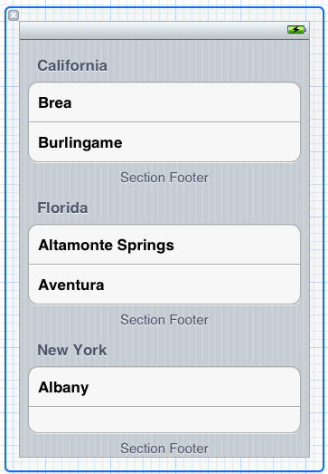
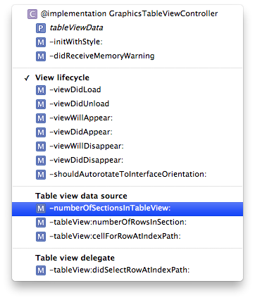

## Learn Objective-C, Building an App (Part 5): Table Views and Nav Controllers 

Table View Controllers and navigation controllers are two of the most commonly used controllers in the iOS SDK. They require a tweaked way of thinking, but they become much easier to use. We'll begin with table views. 

### UITableViewControllers 

There exists a stand-alone `UITableView`, but in many cases `UITableViewController` simplifies usage of the table view. It handles loading table views from XIBs, reloading data, editing, and implements the data source and delegate protocols. Table views display a list of information, potentially millions of objects long, because of a a clever optimization in the data source methods; usually table view cells can be selected and trigger an action or navigate to another view in a navigation hierarchy. This post will build a table view embedded in a navigation controller, which will allow us to build subviews in a later post. 

### Data Sources and Delegates 

Many `UIView`s rely on data source protocols to load data. These protocols often ask your controller about sections in your data, and the objects to be displayed within each section. The delegate protocols usually handle selections and editing. The concept can be a bit difficult to grasp at first, but it is one of distinguishing factors of the iOS SDK and really simply your program. 

### Creating the controller 

Open up our application in Xcode. Create a New File. Under Cocoa Touch, select UIViewController subclass. Click Next, and call it GraphicsTableViewController and underneath make it a subclass of UITableViewController. Leave the XIB checkbox checked, and create the file. In the XIB, select the table and open the Attributes Inspector. Notice that you can't edit the data in the table view from IB; it contains a list of California cities. In the Attributes, the one setting that you will often change is the "Style" drop-down; your options are "Plain" or "Grouped." Change this to "Grouped." 



*Group Table View Appearance*

Save, and go to GraphicsTableViewController.h. Add the following property: 
    
```objc
@property (strong, nonatomic) NSDictionary *tableViewData;
```

Go to the .m file and synthesize this property. In viewDidLoad, populate this dictionary: 
    
```objc
self.title = @"Graphics Demo";
NSArray *section1 = [NSArray arrayWithObjects:@"Straight Lines", @"Curves", @"Shapes", nil];
    NSArray *section2 = [NSArray arrayWithObjects:@"Solid Fills", @"Gradient Fills", @"Image & Pattern Fills", nil];
    NSArray *section3 = [NSArray arrayWithObjects:@"Simple Animations", @"Bounce", @"Other Options", nil];
    self.tableViewData = [NSDictionary dictionaryWithObjectsAndKeys:section1, @"Section1", section2, @"Section2", section3, @"Section3", nil];
```

First, we have to set the view controller's title so it will display when we create our nav controller. Setting the nav controller's title does nothing; it uses the title of the visible view controller. Having established the data that we're going to put into our table view, scroll down to 
    
```objc
#pragma mark - Table view data source
```

A quick way is to use the jump list, where the section will be delineated. 



*Xcode Jump Lists*

In numberOfSectionsInTableView:, return the count of objects in our dictionary and remove the warning: 
    
```objc
- (NSInteger)numberOfSectionsInTableView:(UITableView *)tableView {
    return [self.tableViewData count];
}
```

Here, the data source method is asking for the number of sections in our table, which controls how it gets displayed (where the section headings/breaks are). We return the count (of objects with keys) in our dictionary. Do something similar for numberOfSectionsInTableView: 
    
```objc
- (NSInteger)tableView:(UITableView *)tableView numberOfRowsInSection:(NSInteger)section {
    id sectionInfo = [self.tableViewData objectForKey:[NSString stringWithFormat:@"Section%d", section   1]];
    return [(NSArray *)sectionInfo count];
}
```

This method asks for the number of elements in a particular section. UITableViews' sections (and rows) are zero-indexed. We get the corresponding section by incrementing the section by 1, and then return the number of elements in that section. 

The next method is where it gets interesting. tableView:cellForRowAtIndexPath: is where you configure each cell in your table; obviously you won't be actually configuring every single cell, that's the job of the computer. 
    
```objc
- (UITableViewCell *)tableView:(UITableView *)tableView cellForRowAtIndexPath:(NSIndexPath *)indexPath {
    static NSString *CellIdentifier = @"Cell";

UITableViewCell *cell = [tableView dequeueReusableCellWithIdentifier:CellIdentifier];
    if (cell == nil) {
        // Common to all cells
        cell = [[UITableViewCell alloc] initWithStyle:UITableViewCellStyleDefault reuseIdentifier:CellIdentifier];
    }

// Configure individual cells
    id section = [self.tableViewData objectForKey:[NSString stringWithFormat:@"Section%d", indexPath.section   1]];
    NSString *rowLabel = [section objectAtIndex:indexPath.row];
    cell.textLabel.text = rowLabel;

return cell;
}
```

A lot of the code in this method has already been written out. First, it creates an object—a string in this case—that is an identifier. The next line is where the optimization comes in. Rather than creating new table cells all the time as you scroll (because creating objects is an "expensive" process), the table view dequeues cells as they scroll off-screen. At their default size, about nine cells fit on-screen at a time, so only nine need to be kept in memory. As they get scrolled off-screen, the properties' values are changed, and it is put back into use. This means that you can have a table with millions of cells, but only nine or fewer have to exist in memory. The code checks to see that a cell exists (for the first few to be created, or if there is an error, there won't be any cells available to dequeue) and if it doesn't a new cell is created. Inside the if statement is where you configure settings that you want to be common to all (or a large number of) cells, perhaps including color and style, or some text that you want on all the cells. After creating the cell, we get our section and pull out the label for the row. We then access the textLabel property of the cell and set its text property to the text we just got. We then return the cell. 

We need to add one more method to the controller to let it display section headings. 
    
```objc
- (NSString *)tableView:(UITableView *)tableView titleForHeaderInSection:(NSInteger)section {
    switch (section) {
        case 0:
            return @"Lines & Shapes";
            break;
        case 1:
            return @"Images & Fills";
            break;
        case 2:
            return @"Animations";
            break;
        default:
            return nil;
            break;
    }
}
```

This method simply goes through the possible values for section and returns a title accordingly. 

That is all you need to get data in a table view. In fact, a simpler table view would not have sections, and could be done using a single array. At this point, however, we have not handled selection. Scroll down a bit further, until you find the method tableView:didSelectRowAtIndexPath:. In the next post, we'll create a view controller that will be displayed when you select each cell; you can see existing support code for that in the template. However, for now, we'll just have the cell deselect itself after the selection is made. 
    
```objc
- (void)tableView:(UITableView *)tableView didSelectRowAtIndexPath:(NSIndexPath *)indexPath {
    [tableView deselectRowAtIndexPath:indexPath animated:YES];
}
```

Nothing to it here—once the cell is selected, this delegate method is called. We just deselect the same cell. 

### Navigation Controllers 

Navigation controllers are often used in conjunction with table views to drill down into a hierarchy of information. You can see this in the Settings app on the iPhone (it's not quite the same on the iPad). Like tab bar controllers, nav controllers are container controllers, in that the majority of their content comes from another view controller. We'll create a nav controller as part of our tab bar and set our table as its root view controller. 

Go into AppDelegate.m and import GraphicsTableViewController.h. Before the creation of the tab bar controller, add the following code: 
    
```objc
GraphicsTableViewController *graphicsTableViewController = [[GraphicsTableViewController alloc] initWithStyle:UITableViewStyleGrouped];
UINavigationController *graphicsNavController = [[UINavigationController alloc] initWithRootViewController:graphicsTableViewController];
navController.title = @"Graphics Demo";
```

Add the nav controller to the tab bar's array. Now build and run the app, and you'll see a third tab in the tab bar. Select it, and you'll see a table view with all the data we've configured. Click on a cell to select it; it'll briefly glow blue before fading again. 

In this post we've covered the basics of populating table views and nav controllers, two fundamental tenets of the iOS SDK. Download the project [here](../Building%20an%20App%20Part%206%20-%20Navigation%20Controllers%20and%20Stacks) . 

*This post is part of the [Learn Objective-C in 24 Days](38.md) course.*

---

[Previous Lesson](93.md) | [Next Lesson](95.md)
