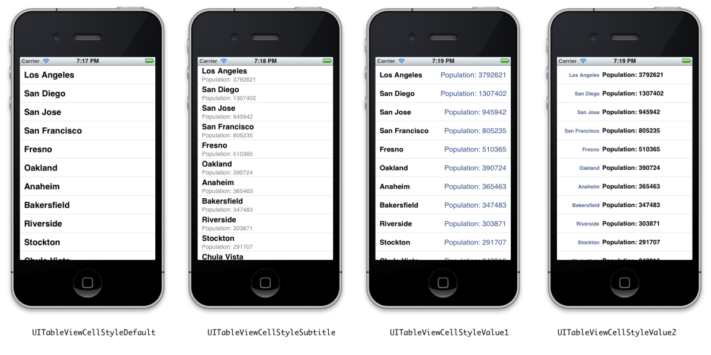

### Learn Objective-C: Advanced Tables

In this post we’re going to take a step away from our existing project and look at other things UITableView will allow us to do. We’ll load in data from a plist, add some more elements to our table view, including images, subtexts, and allowing editing. These features allow us and the user to customize table views beyond the default appearance. Table views are a very important part of the iOS SDK and are found in many apps; fortunately, they are easy to customize- you can even create your own cells in anyway you’d like!

Open Xcode and create a new Single View application. Call it “AdvancedTables”, set the class prefix to “AT”, Device Family to iPhone, and Use Automatic Reference Counting. Save the project somewhere and create it.

Next, [click here](../code_resources/Advanced%20Tables/Cities.plist) to download a file which contains a list of 51 cities and their population. The file is a basic XML-based plist, which is a file type used throughout iOS to store simple data structures like this. Add the file into the Xcode project.

### Setting up the View Controller

Open ATViewController.h and have it adopt `UITableViewDelegate` and `UITableViewDataSource`. In ATViewController.xib, drag out a Table View from the Library and place it inside the existing view. Control-Drag from the table back to File’s Owner, connecting the table’s data source and delegate outlets.

Next, go to ATViewController.h. Create two strong properties of type `NSMutableArray`; call them names and populations. In the .m file, synthesize them. We’ll load in data from the plist in the `viewDidLoad` method:

```objc
- (void)viewDidLoad {
    [super viewDidLoad];
    // Do any additional setup after loading the view, typically from a nib.
    NSString *filePath = [[NSBundle mainBundle] pathForResource:@"Cities" ofType:@"plist"];
    NSData *data = [NSData dataWithContentsOfFile:filePath];
    NSPropertyListFormat format;
    NSString *error;
    id fileContents = [NSPropertyListSerialization propertyListFromData:data mutabilityOption:NSPropertyListImmutable format:&format errorDescription:&error];
    self.populations = [[fileContents objectForKey:@"City Population"] mutableCopy];
    self.names = [[fileContents objectForKey:@"City Names"] mutableCopy];
}
```

Notice that we don’t do any sort of checking on the fileContents result. It would may seem like a good idea to at least check if the dictionary had the two keys; if it only had one, the app would crash when trying to access one or both of them. However, this is a special design consideration. The data source is the driving force of the entire app; it wouldn’t make much sense if some of this data doesn’t exist. We don’t really want the app to continue if the data isn’t valid, so letting it crash might be a good idea in this case.

Next, we implement the data source methods like we did in the last post. Our table will only one section; with a more robust data source such as Core Data, it becomes much easier to implement multiple sections and an index down the side like you’d see in the Music app. For now though, we’ll settle for one section. The number of rows will be determined by the number of elements in either one of the data arrays, as they should correspond- and they do!

```objc
- (NSInteger)numberOfSectionsInTableView:(UITableView *)tableView {
    return 1;
}

- (NSInteger)tableView:(UITableView *)tableView numberOfRowsInSection:(NSInteger)section {
    return [self.names count];
}

- (UITableViewCell *)tableView:(UITableView *)tableView cellForRowAtIndexPath:(NSIndexPath *)indexPath {
    static NSString *cellID = @"CellID";
    UITableViewCell *cell = [tableView dequeueReusableCellWithIdentifier:cellID];
    if (!cell) {        // Create new cell
        cell = [[UITableViewCell alloc] initWithStyle:UITableViewCellStyleSubtitle reuseIdentifier:cellID];
        cell.showsReorderControl = YES;
    }
    cell.textLabel.text = [self.names objectAtIndex:indexPath.row];
    cell.detailTextLabel.text = [NSString stringWithFormat:@"Population: %@", [self.populations objectAtIndex:indexPath.row]];
    cell.imageView.image = [UIImage imageNamed:@"CaliforniaIcon.png"];
    cell.imageView.highlightedImage = [UIImage imageNamed:@"CaliforniaIconPressed.png"];
    return cell;
}
```
Notably here, we create a cell with a different style, one with a subtitle. The iOS SDK comes with four styles, shown below:



*iOS Table View Cell Styles*

The default style doesn’t contain any detail text; nothing will happen if you set the detailTextLabel property.

The `showsReorderControl` property is a boolean; if true, it will display a reordering control that appears in editing mode. We’ll get into that in a little bit.

### Adding an Image to Cells

If you want to add an image to the left of the cell (as with album art in the Music app, or video previews in the YouTube app), it takes very little work. [Download the icons](../code_resources/Advanced%20Tables/Icons) and add the following lines within the if (!cell) block:

```objc
cell.imageView.image = [UIImage imageNamed:@"CaliforniaIcon.png"];
cell.imageView.highlightedImage = [UIImage imageNamed:@"CaliforniaIconPressed.png"];
```

The image property is what gets displayed normally; the highlightedImage is swapped in if the cell is highlighted.

If you want the image anywhere else in the cell, you’ll have to create your own cells, which will be a topic for another post- there’s a lot involved!

### Editing Table Views

First we’ll need some UI to enable editing. Go into the XIB, lower the top margin of the table view, and drag out a normal Navigation Bar and place it at the top of the view, filling the gap. You can have a navigation bar without a nav controller; in that case, it just becomes an "anchor" of sorts for a few commands. You use nav bars at the top of the screen and toolbars at the bottom. Drag out a Bar Button Item and place it on the left of the nav bar; a "well" will appear as you drag over the location. In the Attributes Inspector, set the Title to "Edit". Connect the button to a new property called editingToggle. In addition, create an outlet for the table view; call it tableView. Wire it up.

Create a new method called toggleEdit and wire it up to the button. First, we’ll set the table’s editing mode to whatever it’s currently not- if it’s not in editing, make it enter editing mode and vice versa. Then we’ll adjust the button to reflect this change in state. In iOS, the Done button has a different tint; we can use a system-defined parameter rather than having to approximate it with our own.

```objc
- (IBAction)toggleEdit:(id)sender {
    [self.mainTable setEditing:!self.mainTable.isEditing animated:YES];
    if (self.mainTable.isEditing) {
        [self.editingToggle setStyle:UIBarButtonItemStyleDone];
        [self.editingToggle setTitle:@"Done"];
    }
    else {
        [self.editingToggle setStyle:UIBarButtonItemStyleBordered];
        [self.editingToggle setTitle:@"Edit"];
    }
}
```

Next we implement a few data source methods to allow editing, then to handle the edits.

```objc
- (BOOL)tableView:(UITableView *)tableView canEditRowAtIndexPath:(NSIndexPath *)indexPath {
    return YES;
}

- (BOOL)tableView:(UITableView *)tableView canMoveRowAtIndexPath:(NSIndexPath *)indexPath {
    return YES;
}

- (void)tableView:(UITableView *)tableView moveRowAtIndexPath:(NSIndexPath *)fromIndexPath toIndexPath:(NSIndexPath *)toIndexPath {
    NSUInteger fromRow = [fromIndexPath row];
    NSUInteger toRow = [toIndexPath row];
    id name = [self.names objectAtIndex:fromRow];
    id pop = [self.populations objectAtIndex:fromRow];
    [self.names removeObjectAtIndex:fromRow];
    [self.populations removeObjectAtIndex:fromRow];
    [self.names insertObject:name atIndex:toRow];
    [self.populations insertObject:pop atIndex:toRow];
}

- (void)tableView:(UITableView *)tableView
commitEditingStyle:(UITableViewCellEditingStyle)editingStyle forRowAtIndexPath:(NSIndexPath *)indexPath {
    NSUInteger row = [indexPath row];
    [self.names removeObjectAtIndex:row];
    [self.populations removeObjectAtIndex:row];
    [tableView deleteRowsAtIndexPaths:[NSArray arrayWithObject:indexPath] withRowAnimation:UITableViewRowAnimationFade];
}
```

The first two methods tell the table that all the rows can be edited (in this case, deletion is allowed; the alternative is None or Insertion), and that they can be moved. Then we declare the methods that handle the move or delete (in the latter case, it falls under the `commitEditingStyle:` method). In those methods, we remove (and insert) objects from our backing arrays as necessary.

These edits will remain until the memory is cleared (when the app quits). We’ll look at persistence- saving these changes back to the file- in a later extension.

### Other Actions

The UITableViewDelegate declares some methods to support some other actions, including accessory views (views on the side of the cell, which you can wire up to trigger additional actions). Now, we’ll handle the selection, and allow you to put a check mark next to the cell that the user selects.

First, we’ll need to create a new property of type `NSIndexPath` that will hold the current selection.

```objc
@property (strong, nonatomic) NSIndexPath *lastIndexPath;
```

Next, we need to do some checks in the cellForRow… method- because the method will recycle cells as you scroll, we don’t want the checkmarks to get recycled as well. We check to see if a selection has been made, and if the rows are the same. If they are, then we display the checkmark (this is useful when you scroll back to your selection). Else, we display no checkmark (this is useful if you scroll down or up past your existing selection).

We handle the selection like this:

```objc
- (void)tableView:(UITableView *)tableView didSelectRowAtIndexPath:(NSIndexPath *)indexPath {
    NSUInteger row = indexPath.row;
    NSUInteger oldRow = lastIndexPath.row;
    if (oldRow != row) {
        UITableViewCell *newCell = [tableView cellForRowAtIndexPath:indexPath]; 
        newCell.accessoryType = UITableViewCellAccessoryCheckmark;
        UITableViewCell *oldCell = [tableView cellForRowAtIndexPath:lastIndexPath];
        oldCell.accessoryType = UITableViewCellAccessoryNone;
        lastIndexPath = indexPath;
    }
    [tableView deselectRowAtIndexPath:indexPath animated:YES];
}
```

If the selections are different, we put a checkmark on the new cell and put nothing on the old cell. If they’re the same, nothing changes. In either case, we deselect the cell to prevent it from being highlighted. Build and run, and you can see the checkmark appearing as you click on each cell.

### Row Heights

You can change the height of one or more rows using a simple delegate method:

```objc
- (CGFloat)tableView:(UITableView *)tableView heightForRowAtIndexPath:(NSIndexPath *)indexPath {
    return 88;
}
```

The default height is 44; this method would make the cells twice as high.

### Indenting Rows

You can control the indent of each row with a delegate method:

```objc
- (NSInteger)tableView:(UITableView *)tableView indentationLevelForRowAtIndexPath:(NSIndexPath *)indexPath {
    return indexPath.row;
}
```

This example would create a cascade of cells being indented further with each row. Going beyond a level of 5 or 6 looks really weird, so don’t go too far.

That’s the primary abilities that standard table views can offer. The data source and delegate protocols declare a few other features; we'll touch upon some of them including sections and the index when we start working with files and persistence.

Download the project [here](../code_resources/Advanced%20Tables).

---

[Previous Lesson](89.md) | [Next Lesson](96.md)
