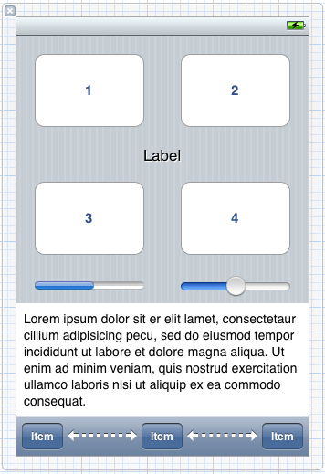
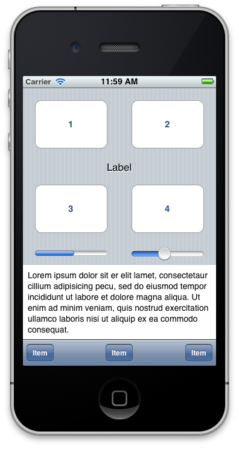
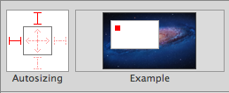
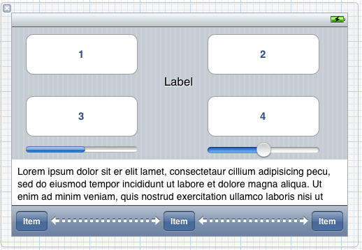

## Learn Objective-C: Rotation 

In this post we'll talk about how to handle rotating a UI. We'll start by using existing constructs to allow our views to support rotation, and then discuss complications and their solutions. Start with a new Single View Application and call it AutoRotate. As usual, I'll be using [ARC](93.md). Open the main view controller's implementation. 

### Enabling Rotation in Code 

First, we have to tell the system that the view controller supports rotation and that it should rotate to a specific orientation. We do this by implementing an existing method on `UIViewController`: 
    
```objc
#pragma mark - Rotation
- (BOOL)shouldAutorotateToInterfaceOrientation:(UIInterfaceOrientation)toInterfaceOrientation {
    return (toInterfaceOrientation != UIInterfaceOrientationPortraitUpsideDown);
}
```

The method might already exist in the file, provided by the template. In that case, simply change the method contents. 

In this method, we're returning a boolean value that tells the system whether to rotate to a specific orientation. We return YES for all supported orientations. Note though that we are not supporting `UIInterfaceOrientationPortraitUpsideDown`. Apple's guidelines state that the upside-down orientation should not be supported unless necessary, because might end up being confused about which way is up, an important feature of phones. Of course, this distinction isn't made on the iPad, and Apple strongly recommends to support all four orientations on iPad. But for now, we'll support all except upside-down. 

Now we'll build the interface and implement the actual rotation logic—open the XIB. Design an interface like this one. It doesn't matter exactly what you use, but keep it simple with some of the basic UI elements. The bar at the bottom is a UIToolbar. I put three UIBarButtonItems on it and two Flexible Spacers in between. 



*Initial View*

We don't need to hook up any of the elements, because we're just concerned with rotating the view. Build and run the app. 



*Initial View in Simulator*

You can rotate the iPhone Simulator by 90 degrees at a time. Go to the Hardware menu, and then select Rotate Left or Rotate Right. You can also use Command-LeftArrow or Command-RightArrow. The rotation will be accompanied by a corresponding animation, and you're left with a view that look like this: 


*Mangled Rotation*

While the background rotated (along with the bottom toolbar, which is handled by the system, the rest of the view didn't change. We can fix that with a few different ways. 

### Struts and Springs 

Struts and springs are a simple IB construct that gives you a few options to stretch and position views. Select the "1″ button and go to the Size Inspector (the one with the Ruler icon). You'll see a section called Autosizing. If you mouse over the Example area to the right, it'll animate to show you the changes. 


*Autosizing UI*

The autosizing area is where you make the changes. You'll see a square with I-beams (struts) on the outside and double arrows (springs) on the inside. The I-beams on the outside acts as "anchors" to the sides of the containing view. The arrows on the inside tell the subview to expand with the containing view. Behavioral conditions: 

* If all the I-beams are enabled, the subview will stay the same size and anchored near (0,0) in the containing view. On the iPhone, that would be the top-left corner. 
* If no I-beams or double arrows are enabled, the subview will stay in the same size in the center of the containing view. 
* If all the double arrows are enabled but no I-beams, the subview will expand proportionally to the containing view. 
* If all the double arrows and I-beams are enabled, the view will expand with the subview, keeping the same distance around all the edges. 

You can see all of this happening in the Example. 

We can use these struts and springs to position some of the UI. All the buttons and the label should have both springs enabled. The progress view and slider should have the horizontal spring enabled. Button 1 should have the top and left struts enabled; button 2 should have top and right. Button 3 should have just left; button 4 should have just right. The label should have no struts enabled. 

The progress view should have just the left strut; the slider just the right strut. The textview at the bottom should have both springs, the bottom, and left and right struts enabled. 

Build and run again, and we see something like this: 



*Struts & Springs UI*

It's almost perfect. Springs and struts give you some basic flexibility—it moved our buttons and label nicely—but for more complex situations, like the lower part of our view, we need something more robust. 

### Swapping Views 

Swapping views as necessary gives you the flexibility to structure your views any way you want using the convenience of Interface Builder. Begin by adding two outlets to the view controller's header: 
    
```objc
@property (strong, nonatomic) IBOutlet UIView *portraitView;
@property (strong, nonatomic) IBOutlet UIView *landscapeView;
```

Synthesize the properties and go over to the XIB. Drag out a new view and go to the Attributes Inspector. Under Orientation in Simulated Metrics, select "Landscape". Build a view similar to this: 



*Manual Landscape View*

Connect the new view as landscapeView, and the old view as portraitView. Go to the implementation file, where we will handle the swap. Add the following code to the bottom of the file, before the @end: 
    
```objc
#define degreesToRadians(x) (M_PI * (x) / 180.0)
- (void)willRotateToInterfaceOrientation:(UIInterfaceOrientation)toInterfaceOrientation duration:(NSTimeInterval)duration {
    if (toInterfaceOrientation == UIDeviceOrientationPortrait) {
        self.view = self.portraitView;
        self.view.transform = CGAffineTransformIdentity;
        self.view.transform = CGAffineTransformMakeRotation(degreesToRadians(0)); 
        self.view.bounds = CGRectMake(0.0, 0.0, 320.0, 460.0);
    }
    else if (toInterfaceOrientation == UIDeviceOrientationLandscapeRight) {
        self.view = self.landscapeView;
        self.view.transform = CGAffineTransformIdentity; 
        self.view.transform = CGAffineTransformMakeRotation(degreesToRadians(-90)); 
        self.view.bounds = CGRectMake(0.0, 0.0, 480.0, 300.0);
    }
    else if (toInterfaceOrientation == UIDeviceOrientationLandscapeLeft) {
        self.view = self.landscapeView;
        self.view.transform = CGAffineTransformIdentity; 
        self.view.transform = CGAffineTransformMakeRotation(degreesToRadians(90)); 
        self.view.bounds = CGRectMake(0.0, 0.0, 480.0, 300.0);
    }
    else
        return;
}
```

We start with a pre-processor macro that converts degrees to radians. iOS uses radians in its graphics work, but it's easier for us people to think in degrees. Note that in this case, we will have to do some custom graphics work, because we will have to transform the view to match the rotation. 

Inside the delegate method, we check for the corresponding orientation and swap the view in the first line of each condition. Then we reset the view's transformation. We'll cover transformations in a future post. We use a provided function to make a rotation transformation and apply it to the view. We also change the size of the view to fit the screen. All of these changes happen in the will method, so they are complete before the actual rotation happen, and the correct view will be displayed in time. Note that animating all aspects of the transition would require additional code, which is beyond the scope of this post. 

### Rotating Tips 

On the iPhone, not all apps support all orientations, or even rotation at all. On iPad, apps should support as many orientations as possible—at least both variants one orientation; preferably all four orientations. 

Note that landscape and portrait views don't necessarily have to present the same information, or even the same appearance. The Music app on the iPhone displays a UIKit-based tab bar and table interface in portrait view, but a custom coverflow interface in landscape. 

If you're doing some custom views/drawing, make sure the view animates when you rotate, especially if you're displaying content such a grid of icons or text. Otherwise, it is a very disorientating experience for the user and might discourage use of your app. 

Finally, make sure there is some meaningful change when the user rotates. If you're just stretching the UI, consider whether it makes sense to rotate, or if rotation is worth the effort. If you have text input, the larger keyboard might be worth it—but you also loose a large portion of the rest of the content. Otherwise, rotating might not be necessary. 

[Download AutoRotate here.](../code_resources/Rotation/)

*This post is part of the [Learn Objective-C in 24 Days](38.md) course.*

---

[Previous Lesson](95.md) | [Next Lesson](97.md)
