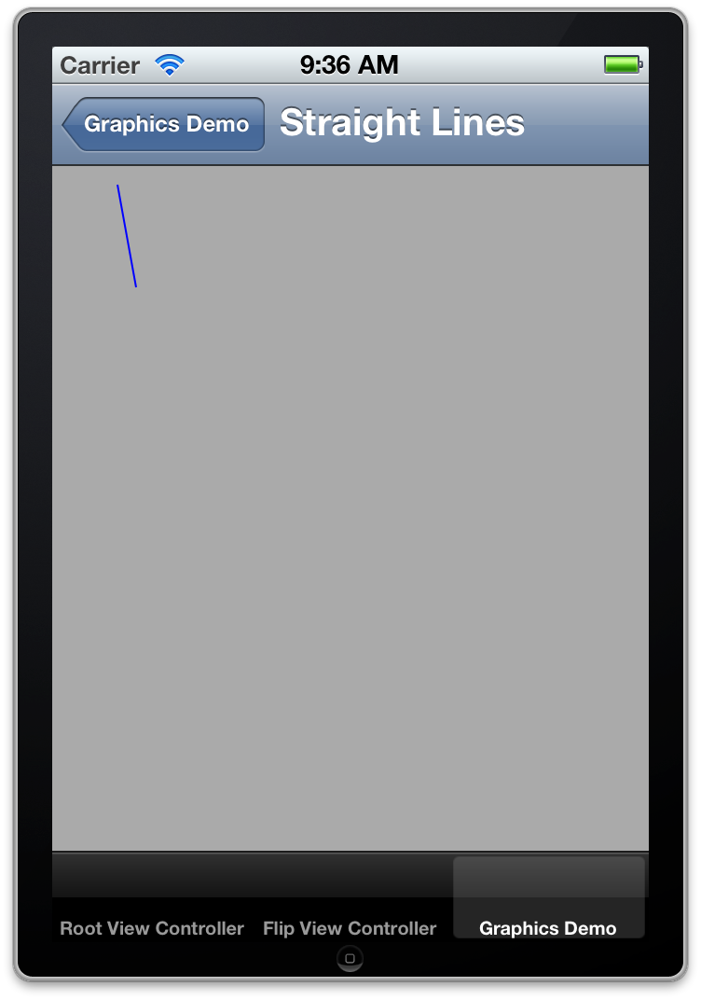
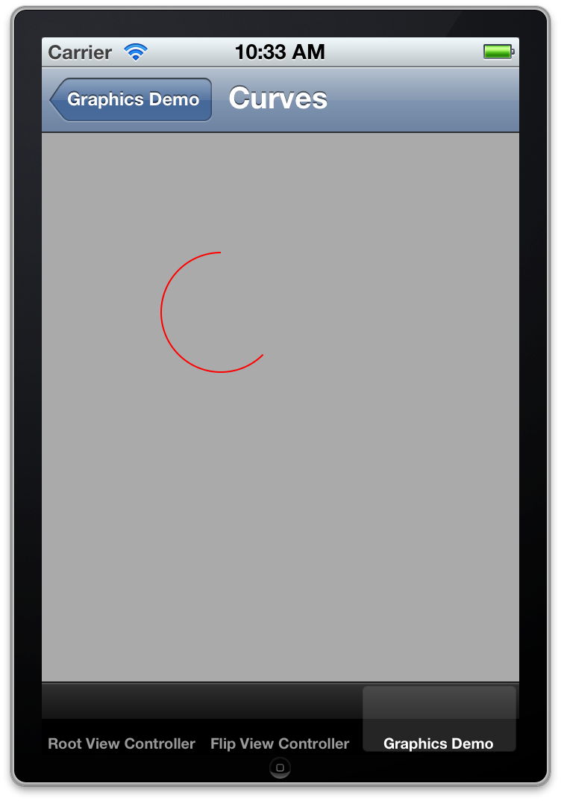
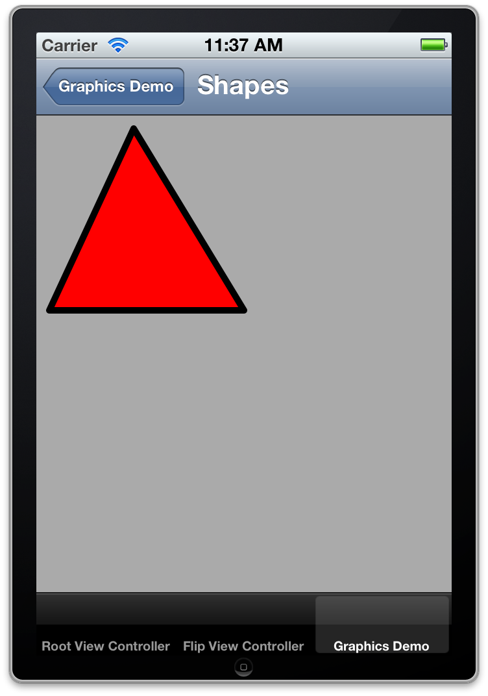

## Learn Objective-C, Building an App (Part 7): Quartz Demo 1

### Adding Frameworks 

First, we have to [add the CoreGraphics and QuartzCore frameworks](41.md) to our project. These frameworks will support the Quartz code we'll be writing. 

### Custom Views 

In iOS, you draw to a view, not a view controller. This means that if you want a view with custom drawing, you'll have to create a subclass of UIView (or a subclass of one of UIKit's views, such as UITableViewCell), and if you have a view controller managing that view, then you may have to do the necessary configuration in code or Interface Builder as well. In our demo app, we see that we have a view controller called CustomDrawingViewController. Right now, it's just managing a stock UIView. We'll need to subclass UIView to do our own drawing, so create a new file, call it CustomView, and make it a subclass of UIView. Switch to CustomView.m and edit the `initWithFrame:` method: 
    
```objc
- (id)initWithFrame:(CGRect)frame {
    if (!(self = [super initWithFrame:frame]))
        return nil;
    self.backgroundColor = [UIColor lightGrayColor];
    return self;
}
```

Here, we're just setting a custom background for our drawing view. Head over to CustomDrawingViewController.m, and set our custom view as the view controller's view: 
    
```objc
- (void)loadView {
    // Implement loadView to create a view hierarchy programmatically, without using a nib.
    CustomView *customView = [[CustomView alloc] initWithFrame:CGRectMake(0, 44, 320, 480)];
    self.view = customView;
}
```

We use loadView here in place of a xib file, because (in my opinion) two lines of code, which is all we will need here, is simpler than a whole file to manage. Make sure you import CustomView.h. If you run the app now and browse through the graphics demos table, you'll see our custom view with the gray background. 

### Drawing a Plan 

We're going to use one custom view to handle all our drawing needs. We will tell the view what type of content to draw, and then we can use Quartz subroutines (a fancy word for methods/functions) to draw the actual content. We'll set up an enumerated type for the different demos we'll work with. In addition, there is a preferred way to work with Quartz subroutines; we'll discuss this as well. 

### Writing the Setup Code 

We'll begin by declaring some constants that we will reference throughout our app. In Xcode, create a new file (Command-N). Under "C and C " on the left, choose "Header File" and save it as "Constants.h". Add the following content: 
    
```objc
typedef enum {
    QuartzContentStraightLines,
    QuartzContentCurves,
    QuartzContentShapes,
    QuartzContentSolidFills,
    QuartzContentGradientFills,
    QuartzContentImageFills,
    QuartzContentSimpleAnimations,
    QuartzContentBounce,
    QuartzContentOther,
} QuartzContentMode;
```
    
In CustomView.h, import Constants.h and declare the following property: 
    
```objc
@property (assign, nonatomic) QuartzContentMode mode;
```

Synthesize the property. Also add the same property to CustomDrawingViewController and synthesize it. 

In CustomDrawingViewController, import Constants.h and declare and implement the following method: 
    
```objc
- (id)initWithContentMode:(QuartzContentMode)contentMode {
    if (!(self = [super init]))
        return nil;
    self.mode = contentMode;
    return self;
}
```

In loadView, after initializing customView, add the following line: 
    
```objc
customView.mode = self.mode;
```

To use this new property, we have to set it when we select a row in our table. Go to GraphicsTableViewController.m, and replace the tableView:didSelectRowAtIndexPath: method with this: 
    
```objc
- (void)tableView:(UITableView *)tableView didSelectRowAtIndexPath:(NSIndexPath *)indexPath {
    CustomDrawingViewController *drawingVC = [[CustomDrawingViewController alloc] initWithContentMode:(QuartzContentMode)indexPath.section * 3   indexPath.row];
    drawingVC.viewTitle = [[tableView cellForRowAtIndexPath:indexPath] textLabel].text;
    [self.navigationController pushViewController:drawingVC animated:YES];
}
```

Knowing that we have three rows in a section, we simply take the indexPath and use it to calculate an integer value that corresponds to our enumerated type (remember than enumerated types are basically specific names given to integer values) and pass it along. 

In CustomView.m, add the following code: 
    
```objc
#pragma mark - Drawing Methods
- (void)drawRect:(CGRect)rect {
    CGContextRef context = UIGraphicsGetCurrentContext();
    switch (self.mode) {
        case QuartzContentStraightLines:
            [self drawStraightLinesInContext:context];
            break;
        case QuartzContentCurves:
            [self drawCurvesInContext:context];
            break;
        case QuartzContentShapes:
            [self drawCustomShapesInContext:context];
            break;
        case QuartzContentSolidFills:
            [self drawSolidFillsInContext:context];
            break;
        case QuartzContentGradientFills:
            [self drawGradientFillsInContext:context];
            break;
        case QuartzContentImageFills:
            [self drawImageAndPatternFillsInContext:context];
            break;
        case QuartzContentSimpleAnimations:
            [self drawSimpleAnimationsInContext:context];
            break;
        case QuartzContentBounce:
            [self drawBouncesInContext:context];
            break;
        case QuartzContentOther:
            [self drawOtherInContext:context];
            break;
        default:
            break;
    }
}
```

### Quartz Methods 

For each subroutine, we have to push and pop a graphics context. Quartz is a state-based drawing system. If we didn't push on a graphics context, and we made a state change, such as changing the stroke or fill color, you don't want to be caught off-guard when you return to the calling method. This could be a bigger issue if the subroutine you're using was written by someone else; it would be nearly impossible (and very impractical) to restore the state to the way it was before the method call without pushing and popping a graphic context. 

In the beginning of the subroutine, we have the following line: 
    
```objc
UIGraphicsPushContext(context);/sourcecode]
Where "context" is an argument passed into the subroutine.
At the end of the method, pop the context:
1UIGraphicsPopContext();
```

Set up all the subroutines as such: 
    
```objc
- (void)drawStraightLinesInContext:(CGContextRef)context {
    UIGraphicsPushContext(context);
    UIGraphicsPopContext();
}

- (void)drawCurvesInContext:(CGContextRef)context {
    UIGraphicsPushContext(context);
    UIGraphicsPopContext();
}

- (void)drawCustomShapesInContext:(CGContextRef)context {
    UIGraphicsPushContext(context);
    UIGraphicsPopContext();
}

- (void)drawSolidFillsInContext:(CGContextRef)context {
    UIGraphicsPushContext(context);
    UIGraphicsPopContext();
}

- (void)drawGradientFillsInContext:(CGContextRef)context {
    UIGraphicsPushContext(context);
    UIGraphicsPopContext();
}

- (void)drawImageAndPatternFillsInContext:(CGContextRef)context {
    UIGraphicsPushContext(context);
    UIGraphicsPopContext();
}

- (void)drawSimpleAnimationsInContext:(CGContextRef)context {
    UIGraphicsPushContext(context);
    UIGraphicsPopContext();
}

- (void)drawBouncesInContext:(CGContextRef)context {
    UIGraphicsPushContext(context);
    UIGraphicsPopContext();
}

- (void)drawOtherInContext:(CGContextRef)context {
    UIGraphicsPushContext(context);
    UIGraphicsPopContext();
}
```

Now let's fill in those methods. 

### Drawing Lines 

Drawing lines, or paths, as they are called in Quartz, begins with defining a path, moving and adding lines to points, and finishing the path. Then you can stroke and/or fill it to make it visible. Note that simply drawing and closing a path will make it exist in memory, but it will not actually be drawn on screen until you request a stroke or fill. We'll start by drawing some lines and playing around with the settings. 
    
```objc
- (void)drawStraightLinesInContext:(CGContextRef)context {
    UIGraphicsPushContext(context);
    CGContextBeginPath(context);
    CGContextMoveToPoint(context, 35, 10);
    CGContextAddLineToPoint(context, 45, 65);
    [[UIColor blueColor] setStroke];
    CGContextStrokePath(context);
    UIGraphicsPopContext();
}
```

If you build and run and navigate to the corresponding view, you'll see a thin blue line in the top-left of the screen. 



*First Quartz Path*

To draw this line, we first have to begin the path using CGContextBeginPath(). This function (most of Quartz is written in C using C-style functions, rather than Objective-C methods) allocates memory for a path and prepares the drawing system, but doesn't actually do anything visible. Think of it as uncapping a pen. The next function is CGContextMoveToPoint(), which takes as arguments the context and an x- and y- coordinate. This sets the beginning point of the line—think of it as moving a pen over the paper and putting it down at a point. Then, we call CGContextAddLineToPoint() which also takes the context and an x- and y- coordinate. This function is analogous to dragging a pen over the page to the second point. We then specify blue as the stroke color. Here, we're using a convenience method that UIColor provides rather than using the corresponding Quartz call. The result is the same, and unless you're working with custom colorspaces it is much easier to just use the convenience methods. There is a corresponding -setFill method for setting the fill color of a path. Finally, we call CGContextStrokePath() to actually draw the path in our blue color. By default the stroke width is 1.0 point. We can change that with a simple function call: 
    
```objc
CGContextSetLineWidth(context, 5.0);
```

Add this line right after the UIColor call. Build and run, and you'll see that the line is now much thicker. 

Add the following line to the code, right after the last line: 
    
```objc
CGContextSetLineCap(context, kCGLineCapRound);
```

If you build and run now, you'll see that the line's ends are not squared off, but nicely rounded. In fact, it is defined as such: 

> Quartz draws a circle with a diameter > equal to the line width around the > point where the two segments meet, > producing a rounded corner. The > enclosed area is filled in. 

The idea here is that to draw lines in Quartz, you begin by defining the path and its endpoints. Then you specify the stroke color and other stroke settings, then actually stroke it. So try drawing another line—make it red, and stretch diagonally down and to the left from the upper-right corner. 

Something like this: 
    
```objc
CGContextBeginPath(context);
CGContextMoveToPoint(context, 250, 35);
CGContextAddLineToPoint(context, 85, 130);
[[UIColor redColor] setStroke];
CGContextSetLineWidth(context, 2.0);
CGContextSetLineCap(context, kCGLineCapSquare);
CGContextStrokePath(context);
```

You can simply append this code right after the existing code, but before popping the context. Here I'm using a square line cap, defined as: 

> Quartz extends the stroke beyond the > endpoint of the path for a distance > equal to half the line width. The > extension is squared off. 

One other aspect of paths is a dashed path, which "allows you to draw a segmented line along the stroked path". The path can be varied in complexity. Here are a few examples: 
    
```objc
CGContextBeginPath(context);
CGContextMoveToPoint(context, 55, 120);
CGContextAddLineToPoint(context, 65, 220);
[[UIColor greenColor] setStroke];
CGContextSetLineWidth(context, 3.0);
float lengths[] = {2.0, 6.0};
CGContextSetLineDash(context, 0, lengths, 2);
CGContextStrokePath(context);
CGContextBeginPath(context);
CGContextMoveToPoint(context, 105, 150);
CGContextAddLineToPoint(context, 65, 290);
[[UIColor blackColor] setStroke];
CGContextSetLineWidth(context, 3.0);
float lengths2[] = {7.5, 4.5, 1.0};
CGContextSetLineDash(context, 3, lengths2, 3);
CGContextStrokePath(context);
CGContextBeginPath(context);
CGContextMoveToPoint(context, 180, 120);
CGContextAddLineToPoint(context, 260, 340);
[[UIColor orangeColor] setStroke];
CGContextSetLineWidth(context, 2.0);
float lengths3[] = {5.0, 3.0, 4.0, 2.0, 3.0, 5.0, 2.0, 4.0, 1.0, 8.0, 1.0, 2.0, 1.0, 3.0, 1.0, 4.0, 1.0, 5.0};
CGContextSetLineDash(context, 2, lengths3, 18);
CGContextSetLineCap(context, kCGLineCapRound);
CGContextStrokePath(context);
```

The function to set the dash is `CGContextSetLineDash()`. This takes four parameters. The first is the context. The second is an amount of offset—you can start a few pixels into the pattern which you specify in the third argument, which is a C-style array of floats. The fourth argument is the number of elements in that array. 

One final point here: we've made a lot of changes to the graphics context, setting stroke colors, line caps, and dash patterns. If we didn't push and pop the context, these changes would be used for the rest of the drawing in `drawRect:`, which is almost never what we want. It's important to push and pop because it restores the calling context. 

### Drawing Curves 

Curve geometry is more complex than straight lines, but the same path concepts apply. There are two main types of curves you can draw: arcs, which are segments of a circle, and Bézier curves, which are free-form curves defined by tangent points. Arcs are much easier to work with. Let's look at an example: 
    
```objc
- (void)drawCurvesInContext:(CGContextRef)context {
    UIGraphicsPushContext(context);
    CGContextBeginPath(context);
    //CGContextMoveToPoint(context, 25, 50);
    //CGContextAddLineToPoint(context, 50, 25);
    CGContextAddArc(context, 120, 120, 40, 0.25*M_PI, 1.5*M_PI, 0);
    [[UIColor redColor] setStroke];
    CGContextStrokePath(context);
    UIGraphicsPopContext();
}
```

Build and run, and you should see a portion of a circle in red on the screen. 



*Quartz Arc*

You can also lead into the arc with a straight line: 
    
```objc
CGContextBeginPath(context);
CGContextMoveToPoint(context, 25, 50);
CGContextAddLineToPoint(context, 120, 25);
CGContextAddArc(context, 120, 120, 40, 0.25*M_PI, 1.5*M_PI, 0);
[[UIColor redColor] setStroke];
CGContextStrokePath(context);
```

Quartz will then draw a straight line from the end of your line to the start of the arc. 

You define an arc by calling the function `CGContextAddArc()`. The first argument is the context. The next two are x- and y- coordinates for the center of the arc—the center point of the circle from which the arc is drawn. The fourth argument is the radius of the circle. The next two are the start angle and end angle, measured in radians where zero is horizontally to the right—the "positive x-axis". The last argument is either a 0 or 1, where 0 is counterclockwise and 1 is clockwise. 

Bézier curves are usually quadratic or cubic in nature, and are defined by a mathematical formula that act on the starting and ending points and one or more control points. From Apple's documentation on Quartz: 

> The placement of the two control > points determines the geometry of the > curve. If the control points are both > above the starting and ending points, > the curve arches upward. If the > control points are both below the > starting and ending points, the curve > arches downward. If the second control > point is closer to the current point > (starting point) than the first > control point, the curve crosses over > itself, creating a loop. 

The curve that results is always tangental to the path that can be drawn between the starting and ending points, tracing through all the control points in order. 

The following example draws three curves, and shows the control path for one of them: 
    
```objc
CGContextBeginPath(context);
CGContextMoveToPoint(context, 150, 100);
CGContextAddQuadCurveToPoint(context, 250, 20, 300, 100);
[[UIColor purpleColor] setStroke];
CGContextStrokePath(context);

CGContextBeginPath(context);
CGContextMoveToPoint(context, 180, 220);
CGContextAddQuadCurveToPoint(context, 300, 0, 310, 180);
[[UIColor magentaColor] setStroke];
CGContextStrokePath(context);

CGContextBeginPath(context);
CGContextMoveToPoint(context, 10, 260);
CGContextAddCurveToPoint(context, 100, 160, 210, 360, 300, 290);
[[UIColor greenColor] setStroke];
CGContextStrokePath(context);

// Draw control path for cubic curve
CGContextBeginPath(context);
CGContextMoveToPoint(context, 10, 260);
CGContextAddLineToPoint(context, 100, 160);
CGContextAddLineToPoint(context, 210, 360);
CGContextAddLineToPoint(context, 300, 290);
[[UIColor darkGrayColor] setStroke];
CGContextSetLineWidth(context, 0.5);
float lengths[] = {2.0, 1.0};
CGContextSetLineDash(context, 0, lengths, 2);
CGContextStrokePath(context);
```

The first two examples draw a quadratic Bézier curve with one control point. The function of interest is `CGContextAddQuadCurveToPoint()`. The first argument is the context, followed by the x- and y- coordinates of the control points and the x- and y- coordinates of the end point. Moving the control point can dramatically change the shape of the curve. 

The third example is a cubic Bézier curve with two control points. `CGContextAddCurveToPoint()` takes the context, the x- and y- coordinates of the first control point, the x- and y- coordinates of the second control point, and the x- and y- coordinates of the end point. The control points pull the curve along; I've illustrated the control path formed by the control points in a dashed gray line. Of course, all the things you can do with regular paths apply to curves as well; in fact, think of curves as a path component that you can easily append to existing paths. You can chain multiple paths together just by beginning a path, adding lines and curves, and stroking it. Now let's talk about closing paths. 

### Shaping Up 

A shape is simply a closed path. You can make polygons with straight lines; this code will draw a triangle: 
    
```objc
CGContextBeginPath(context);
CGContextMoveToPoint(context, 75, 10);
CGContextAddLineToPoint(context, 160, 150);
CGContextAddLineToPoint(context, 10, 150);
CGContextClosePath(context);
[[UIColor redColor] setFill];
[[UIColor blackColor] setStroke];
CGContextSetLineWidth(context, 5.0);
CGContextSetLineJoin(context, kCGLineJoinRound);
CGContextDrawPath(context, kCGPathFillStroke);
```

Everything here we've seen before, except for `CGContextClosePath()` which automatically inserts a line from the last point to the first. In addition, `CGContextSetLineJoin()` is similar to setting the line cap, but used for the intersection of two paths rather than the ends. This code results in something like this: 



*Quartz Shapes*

Quartz includes some convenient ways to draw rectangles, ellipses, and circles. 
    
```objc
// Draw rectangle
    CGContextBeginPath(context);
    CGContextAddRect(context, CGRectMake(200, 45, 100, 63));
    [[UIColor yellowColor] setFill];
    [[UIColor greenColor] setStroke];
    CGContextSetLineWidth(context, 3.0);
    CGContextDrawPath(context, kCGPathFillStroke);

// Stroke Ellipse
    CGContextBeginPath(context);
    CGContextAddEllipseInRect(context, CGRectMake(35, 200, 180, 120));
    [[UIColor blueColor] setStroke];
    CGContextDrawPath(context, kCGPathStroke);

// Fill Circle
    CGContextBeginPath(context);
    CGContextAddEllipseInRect(context, CGRectMake(220, 150, 70, 70));
    [[UIColor orangeColor] setFill];
    CGContextDrawPath(context, kCGPathFill);
```

Quartz provides `CGContextAddRect()` to draw a `CGRect` struct. This is an easier way to draw a rectangle than manually calculating and adding lines to points. Quartz also provides `CGContextAddEllipseInRect()` which draws an ellipse in the rectangle, using filling the width and height of the rectangle; the rectangle itself does not get drawn. To draw a circle, pass in a rect that has the same width and height- a square. 

Drawing other polygons is a bit harder. This code snippet (from a CS193P lecture) calculates an `NSArray` of vertex points for a polygon of a certain number of sides in a rect: 
    
```objc
- (NSArray *)pointsForPolygonWithSides:(NSInteger)numberOfSides inRect:(CGRect)rect {
    CGPoint center = CGPointMake(rect.size.width / 2.0, rect.size.height / 2.0);
    float radius = 0.9 * center.x;
    NSMutableArray *result = [NSMutableArray array];
    float angle = (2.0 * M_PI) / numberOfSides;
    // float exteriorAngle = M_PI - ((2.0 * M_PI) / numberOfSides);
    float rotationDelta = angle - (0.5 * (M_PI - ((2.0 * M_PI) / numberOfSides)));

    for (int currentAngle = 0; currentAngle < numberOfSides; currentAngle) {
        float newAngle = (angle * currentAngle) - rotationDelta;
        float curX = cos(newAngle) * radius;
        float curY = sin(newAngle) * radius;
        [result addObject:[NSValue valueWithCGPoint:CGPointMake(center.x   curX   rect.origin.x, center.y   curY   rect.origin.y)]];
    }
    return result;
}
```

To draw a heptagon (7-sided polygon), add that method to CustomView.m, and use this drawing code: 
    
```objc
// Draw heptagon
NSArray *points = [self pointsForPolygonWithSides:7 inRect:CGRectMake(230, 250, 70, 70)];
CGContextBeginPath(context);
CGPoint firstPoint = [[points objectAtIndex:0] CGPointValue];
CGContextMoveToPoint(context, firstPoint.x, firstPoint.y);
for (int index = 1; index < [points count]; index  ) {
    CGPoint nextPoint = [[points objectAtIndex:index] CGPointValue];
    CGContextAddLineToPoint(context, nextPoint.x, nextPoint.y);
}
CGContextClosePath(context);
[[UIColor magentaColor] setFill];
[[UIColor blackColor] setStroke];
CGContextDrawPath(context, kCGPathFillStroke);
```

In the next section, we'll look at the next section of Quartz graphics. 

*This post is part of the [Learn Objective-C in 24 Days](38.md) course.*

---

[Previous Lesson](97.md) | [Next Lesson](100.md)
